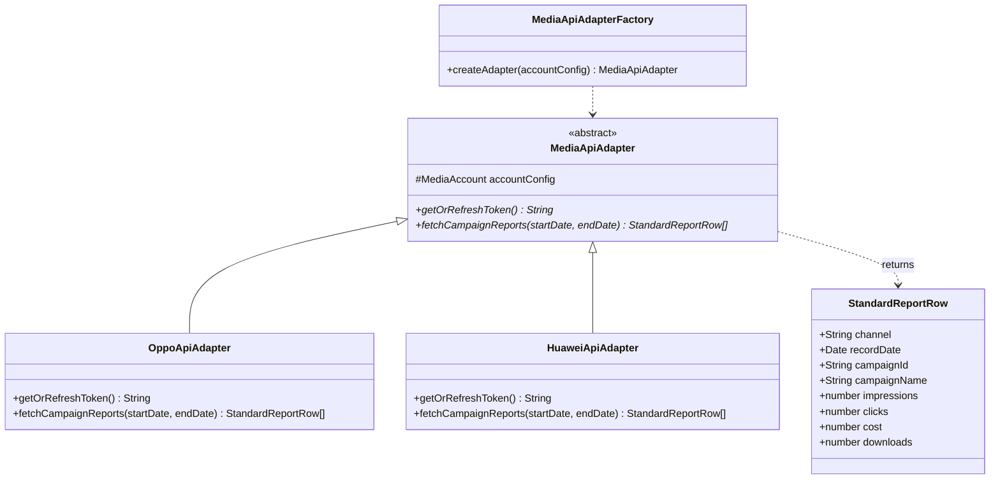

# 媒体平台 Marketing API 接入与自动化同步设计文档

*   **设计主题**：多渠道媒体平台 Marketing API 接入与自动同步设计（第一阶段：OPPO & 华为）
*   **编写日期**：2026-05-29
*   **状态**：已由用户逐步评审并通过 (Approved)
*   **保存路径**：`docs/superpowers/specs/2026-05-29-marketing-api-integration-design.md`

---

## 1. 背景与目标 (Background & Goal)

“端外买断工作台”目前已实现基于手动 Excel 上传的广告效果报表呈现。为了将运营人员从每日手动导出与上传 Excel 的繁琐工作中解放出来，实现系统的高自动化与数据实时准确性，我们需要将投放数据拉取流程全面升级为**直接对接媒体平台的官方 Marketing API**。

### ⚠️ 核心业务口径与对齐准则
根据历史代码和业务规则，系统内的 `RawData` 数据实际上是由**双边数据拼合而成**的：
1.  **媒体侧数据（流量与成本）**：包含曝光、点击、花费、下载。这部分数据直接从华为、OPPO 等媒体平台通过 API 拉取，作为消耗端事实。
2.  **转化侧数据（效果与开户）**：包含激活、转正激活、留号码（线索）、开户。这部分数据**必须以我方内部的转化文件/另一张表为唯一口径**（以避开大媒体平台自身的统计偏差及延迟归因口径），作为转化端事实。

两边数据在数据库中通过 **联合键 `(渠道 channel, 日期 recordDate, 计划ID campaignId)`** 进行异步合并与拼接，从而配合现有的分析与报表脚本。

---

## 2. 数据库设计 (Database Schema)

在后端的 `server/prisma/schema.prisma` 中，新增名为 `MediaAccount` 的模型，用于持久化存储各个媒体投放账号的接口密钥和临时 Token。

```prisma
model MediaAccount {
  id             Int       @id @default(autoincrement())
  channel        String    // 媒体渠道标识：'oppo', 'huawei', 'xiaomi', 'vivo', 'hihonor'
  accountId      String    @map("account_id")     // 媒体平台的广告账户ID
  accountName    String?   @map("account_name")   // 账户别名（如：买断主包-账号01，方便运营识别）
  clientId       String    @map("client_id")      // 各媒体分配的 Client ID / App ID
  clientSecret   String    @map("client_secret")  // 各媒体分配的 Client Secret / App Key
  accessToken    String?   @map("access_token")   // 接口缓存的当前有效调用 Token
  refreshToken   String?   @map("refresh_token")  // 刷新 Token (部分媒体授权码模式备用)
  tokenExpiresAt DateTime? @map("token_expires_at") // 缓存 Token 的过期时间
  isActive       Boolean   @default(true) @map("is_active") // 是否开启该账户的定时自动同步
  createdAt      DateTime  @default(now()) @map("created_at")
  updatedAt      DateTime  @updatedAt @map("updated_at")

  // 设置联合唯一索引：同一个媒体渠道下，广告账户 ID 必须唯一，防止重复配置同一个账号
  @@unique([channel, accountId], name: "unique_channel_account")
  // 建立索引，方便定时任务以及后端接口快速查询
  @@index([channel])
  @@index([isActive])
  @@map("media_accounts")
}
```

---

## 3. 后端适配器架构设计 (Architecture & Classes)

为了应对各厂商接口返回字段千差万别的问题，我们设计了**适配器模式 (Adapter Pattern)**，将差异性封装在具体的适配器子类中，而向外部同步服务提供高度归一化的数据格式。



### 3.1 归一化数据格式 (`StandardReportRow` — 仅限流量端)
无论媒体官方接口返回何种字段命名，在转换后统一映射为（**不包含激活、开户等转化端字段**）：
*   `channel`: 渠道名称（如 'oppo'）
*   `recordDate`: 投放日期（Date 类型）
*   `campaignId`: 计划唯一标识 ID
*   `campaignName`: 计划备注名称
*   `impressions`: 曝光量
*   `clicks`: 点击数
*   `cost`: 消耗金额
*   `downloads`: 下载量

### 3.2 抽象基类 (`MediaApiAdapter`)
定义了媒体调用的两大基石方法：
1.  `getOrRefreshToken()`：负责根据当前时间判断临时 `accessToken` 是否已经到期。如果已过期，则调用相应大媒体的鉴权接口刷新，并将最新的 Token 与过期时间回写到数据库 `media_accounts` 表中；如果未过期，则直接返回缓存的 Token。
2.  `fetchCampaignReports(startDate, endDate)`：接收规范的 `YYYY-MM-DD` 时间区间参数，调用官方的接口获取计划层级的报表，并将报表字段转换为标准 `StandardReportRow[]`。

---

## 4. 定时任务与增量去重写入策略（双边异步对齐）

### 4.1 解决延迟归因误差
考虑到大媒体平台存在一定的转化归因延迟（例如 T-1 的点击可能在 T+1 才发生最终激活或开户，导致 T-1 数据发生微调），我们的同步策略为：
*   **同步周期**：使用 `node-cron` 定时器，每天凌晨 **02:30** 触发运行（大媒体此时已完成前一天的结账与数据归档）。
*   **同步区间**：每天重新拉取 **T-3 到 T-1（过去3天）**的完整数据，强制覆盖刷新本地。

### 4.2 增量写入策略 (SQLite Upsert 字段防冲突保护)
为了防止 API 消耗数据覆盖已经从转化表匹配好的开户数（accounts）和激活数（activations），我们必须在 Prisma Upsert 中进行**字段过滤更新**。

依靠 `RawData` 表在 `[channel, recordDate, campaignId]` 上的唯一索引 `unique_channel_date_campaign` 进行操作：
*   **若冲突（已存在相同计划相同日期数据）**：**仅更新媒体字段**，绝不更新/不覆盖任何转化字段。
    ```typescript
    update: {
      campaignName: row.campaignName,
      impressions: row.impressions,
      clicks: row.clicks,
      cost: row.cost,
      downloads: row.downloads
      // ⚠️ 绝不更新 activations, formalActivations, leads, accounts 字段！
    }
    ```
*   **若无冲突（新记录）**：插入全新数据，流量段字段使用 API 数据，转化端字段默认设为 0。

---

## 5. 首批媒体 API 接入流细则

### 5.1 OPPO (Omni API) 接入
*   **接口域名**：`https://openapi.heytapmobi.com`
*   **获取 Token**：`POST /oauth2/v1/token` 传入 `client_id`，`client_secret`，`grant_type=client_credentials`。
*   **获取报表**：调用 OPPO 的 `Report API`，查询计划列表，传入账号 ID 与日期范围，将返回的金额等指标归一化转换（注意：OPPO 返回的花费金额可能为分，需要转换为元）。

### 5.2 华为 (Petal Ads / 鲸鸿动能) 接入
*   **接口域名**：华为开发者官方 API 域名
*   **获取 Token**：使用“服务器应用”类型的 Credentials，获取 Access Token。
*   **获取报表**：调用华为鲸鸿动能的 `HMS API` 中“查询推广任务统计报表”相关接口，拉取花费（需按汇率或官方标准格式校正）和下载/点击等流量数据，并转换后返回。

---

## 6. 前端配置管理界面

我们将在“数据管理”菜单下，新增一个简洁的 **“媒体配置”** 子页面：
1.  **数据列表**：以表格形式展示当前已配置的所有媒体账户（包括渠道名、账号ID、别名、是否启用状态等）。
2.  **表单录入**：点击“新增账户”，弹出对话框，由运营手动录入：
    *   **渠道选择**：下拉选择（华为、小米、OPPO、vivo、荣耀）
    *   **账号 ID**：对应的媒体平台广告主账号 ID
    *   **账号别名**：便于业务识别的备注（如“买断账号-01”）
    *   **Client ID (或 App ID)**：媒体平台密钥 ID
    *   **Client Secret (或 App Key)**：媒体平台密钥
3.  **开关控制**：支持一键启用或禁用该账号的定时拉取。
