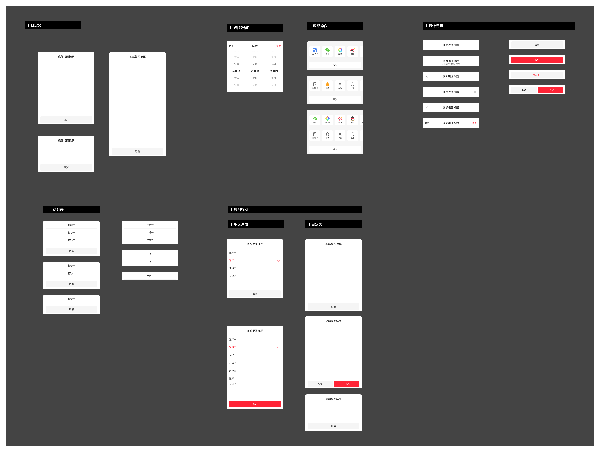

# Bottom Sheet（底部视图）

## Overview

底部视图是用户发起、与当前情景相关的任务或内容的临时视图。按内容复杂度分为**行动列表**和**底部视图**两种类型，通过从屏幕底部滑入展示。

**设计师：** 刘勇

---

## 组件类型（Component Types）

| 类型 | Figma 前缀 | 适用场景 |
|---|---|---|
| 行动列表 | `底部弹窗/01行动列表` | 内容简单、交互简单；如分享、单选、多选 |
| 底部视图 | `底部弹窗/02底部视图` | 内容较多且交互复杂；可被动触发 |

> **选择原则：** 内容简单、用户主动触发 → 行动列表；内容多且交互复杂、可能被动触发 → 底部视图。

---

## 命名规范（Naming Convention）

```
底部弹窗 / [分类] / [变体]
```

示例：
- `底部弹窗/01行动列表/07大于三个选项`
- `底部弹窗/04标题组合/04单行标题+关闭`
- `底部弹窗/05按钮组合/04双按钮_取消+确定`

---

## 尺寸规范（Dimensions）

| 属性 | 值 | Token |
|---|---|---|
| 宽度 | 全屏宽度（375px 基准） | — |
| 圆角（左上 + 右上） | 10px | `radius-xxl` |
| 最小高度 | 240px（约 30% 屏幕高度） | — |
| 常规高度 | 480px（约 60% 屏幕高度） | — |
| 最大高度 | 约 90% 屏幕高度 | — |

### 高度行为

| 高度状态 | 规则 |
|---|---|
| **最小（240px）** | 内容较少时使用；约占屏幕 30% |
| **常规（480px）** | 大多数场景的默认高度；约占屏幕 60% |
| **最大（~90%）** | 内容超出常规高度时自动增长至此；标题和按钮固定，内容区可滚动 |

---

## 标题区（Header）

**组件前缀：** `底部弹窗/04标题组合`  
**固定高度：** 64px

| 变体 | Figma 名称 | 左侧 | 标题 | 右侧 |
|---|---|---|---|---|
| 仅标题 | `01单行标题` | — | 居中 | — |
| 标题 + 二级说明 | `02标题+二级说明文字` | — | 居中，下方附说明文字 | — |
| 标题 + 返回 | `03单行标题+返回` | ← 返回图标 | 居中 | — |
| 标题 + 关闭 | `04单行标题+关闭` | — | 居中 | × 关闭图标 |
| 标题 + 返回 + 关闭 | `05单行标题+返回+关闭` | ← 返回图标 | 居中 | × 关闭图标 |
| 标题 + 文字按钮 | `06单行标题+确定+取消` | 取消（文字） | 居中 | 确定（文字） |

### 标题区尺寸

| 元素 | 位置 / 尺寸 | Token |
|---|---|---|
| 标题文字 | x=56, y=21，宽 263px，高 22px | — |
| 图标（返回 / 关闭） | 24×24px；返回 x=16，关闭 x=335，y=20 | `sizing-square-base` |
| 图标距左/右边 | 16px | `margin-loose` |
| 二级说明文字 | y=45，高度 18px | `line-height-large` |

### 何时使用哪种标题

| 场景 | 使用的标题类型 |
|---|---|
| 简单内容、用户主动触发 | 单行标题 + 关闭（×） |
| 连续性操作、上下级前后步骤 | 单行标题 + 返回（←） |
| 系统选择类（时间、日期） | 单行标题 + 确定/取消文字按钮 |
| 功能按钮与关闭按钮共存 | 视业务场景而定（可用 `05` 返回+关闭） |

---

## 按钮区（Footer）

**组件前缀：** `底部弹窗/05按钮组合`  
**固定高度：** 60px（按钮本体 44px，上下各 8px 内边距 → `padding-base`）

| 变体 | Figma 名称 | 布局 | 背景色 | Token | 文字色 | Token |
|---|---|---|---|---|---|---|
| 单按钮_取消 | `01单按钮_取消` | 全宽 343px | 灰底 | `color-background-weak` | 深色 | `color-text-primary` |
| 单按钮_确定 | `02单按钮_确定` | 全宽 343px | `#2E58FF` | `color-brand-primary` | 白 | `color-text-inverse` |
| 单按钮_我知道了 | `03单按钮_我知道了` | 全宽 343px | `#2E58FF` | `color-brand-primary` | 白 | `color-text-inverse` |
| 双按钮_取消+确定 | `04双按钮_取消+确定` | 左 167px + 8px 间距 + 右 168px | 灰 / 红 | `color-background-weak` / `color-brand-primary` | 深 / 白 | `color-text-primary` / `color-text-inverse` |

> 双按钮排列时：取消在左，确定在右；左右两侧各留 16px（`padding-extra-loose`）外边距，按钮间距 8px（`margin-base`）。

---

## 行动列表选项（Action List Options）

**组件前缀：** `底部视图/06选项组合`  
**每行高度：** 52px

| 状态 | 文字颜色 | Token | 字重 | Token | 右侧图标 |
|---|---|---|---|---|---|
| 未选择 | `rgba(0,0,0,0.84)` | `color-text-primary` | Regular (400) | `font-weight-regular` | 无 |
| 已选择 | `#2E58FF` | `color-brand-primary` | Medium (500) | `font-weight-medium` | 勾选图标 24×24px（`sizing-square-base`） |

### 选项行内间距

| 属性 | 值 | Token |
|---|---|---|
| 文字左边距 | 16px | `margin-loose` |
| 文字纵向位置（未选） | y=16 | — |
| 文字纵向位置（已选） | y=15 | — |
| 分割线粗细 | 0.5px | `sizing-border-extra-small` |
| 分割线位置 | 行底部，左右各缩进 14px | — |
| 最后一项 | 无底部分割线 | — |

---

## 场景说明（Use Cases）

### 行动列表（Action List）

适用场景：
- 内容简单、交互操作简单，如：分享、单选、多选
- 专业名词解释、信息说明（用户主动触发）

### 底部视图（Bottom View）

适用场景：
- 内容多且交互行为复杂
- 被动触发的场景（系统或业务主动弹出）

### 连续性操作

底部弹窗存在连续性操作（如支付流程中的多步选择）时，使用**返回（←）** 按钮保持流程连贯，避免每步都关闭重开。

### 多次唤起

同一页面需要多次唤起底部视图（或存在多个底部视图叠加）时，需保持视觉和交互的一致性，避免叠层混乱。

---

## 背景规范

| 场景 | 背景 | Token |
|---|---|---|
| 常规 | 白色卡片背景 | `color-foreground-layer1` |
| 特殊（内容需与页面融合） | 使用页面背景色 / 卡片反白 / 自定义按钮区背景 | — |

### 背景蒙层

| 属性 | 值 | Token |
|---|---|---|
| 颜色 + 不透明度 | `rgba(0,0,0,0.60)` | `color-background-mask-level2` |
| 覆盖范围 | 可视屏幕全区域 | — |

---

## Constraints / Do & Don't

| | 规则 |
|---|---|
| ✅ | 根据内容复杂度选择行动列表或底部视图 |
| ✅ | 连续性操作使用返回（←）按钮，单次操作使用关闭（×）按钮 |
| ✅ | 双按钮时：取消在左，确定在右 |
| ✅ | 选项 > 常规高度时，启用内容区滚动，标题和按钮固定 |
| ✅ | 推广/系统类弹窗（时间、日期）使用文字按钮（确定/取消）在标题区 |
| ❌ | 不要在行动列表里放复杂的表单或大量内容 |
| ❌ | 不要让底部视图超过 90% 屏幕高度而不启用滚动 |
| ❌ | 不要将关闭和返回同时省略，底部视图必须有退出入口 |

---

## Examples


