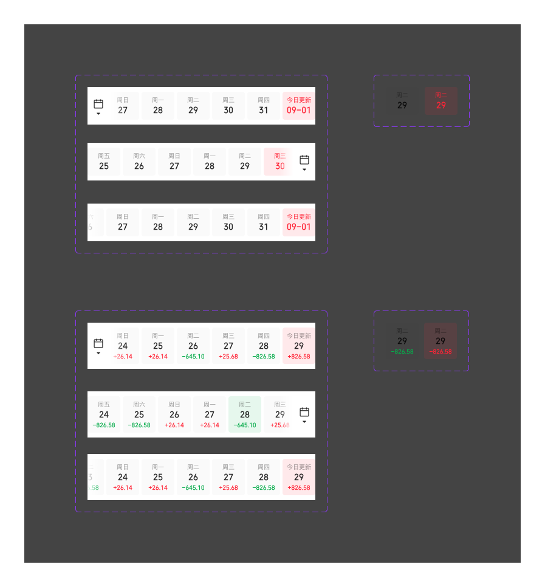

# CalendarTab 日历tab

## 定义

日历 tab 是用于**频繁、快速切换日期**的横向滚动选项卡组件。

---

## 组件构成

```
CalendarTab
├── 可滚动 tab 标签列表（水平排列，可左右滑动）
│   └── tab 标签（.日历tab标签 / .收益日历标签）
└── 日历入口按钮（可选，位置左或右）
    ├── 图标/A10 日历（20×20px）
    ├── 图标/B29箭头-填充-下（12×12px）
    └── 滑动渐变遮挡（24×62px / 24×76px，white→transparent）
```

**配置维度：**
- Tab 文字：可只显示日期数字，也可显示星期几 + 日期
- 日历按钮：有 / 无
- 日历按钮位置：左侧 / 右侧

---

## 组件类型 — 按内容类型

### 01 日历tab

用于按日期维度浏览数据（如行情、资讯），每个 tab 显示星期几与日期。

| 属性 | 规格 |
|---|---|
| 容器尺寸 | 54×46px |
| 背景色（默认） | `color-background-weak2` `rgba(0,0,0,0.02)` |
| 圆角 | 4px |
| gap（内部，星期与日期） | 2px |
| 星期标签 | `font-family-ios-cn` `font-weight-regular` · 10px · leading 12px · `color-text-tertiary` `rgba(0,0,0,0.4)` |
| 日期数字 | `font-family-number` `font-weight-medium` · 14px · leading 18px · `color-text-primary` `rgba(0,0,0,0.84)` |

**选中状态：**

| 属性 | 规格 |
|---|---|
| 背景色 | `color-transparent-red` `rgba(46,88,255,0.1)` |
| 文字颜色（星期 + 日期） | `color-red` `#2E58FF` |

**"今日更新"标签：** 星期文字替换为「今日更新」，样式不变。

---

### 02 日历收益tab

用于展示每日收益，每个 tab 显示星期几、日期数字、当日收益金额。

| 属性 | 规格 |
|---|---|
| 容器尺寸 | 54×60px |
| 背景色（默认） | `color-background-weak2` `rgba(0,0,0,0.02)` |
| 圆角 | 4px |
| gap（内部三行） | 2px |
| 星期标签 | `font-family-ios-cn` `font-weight-regular` · 10px · leading 12px · `color-text-tertiary` `rgba(0,0,0,0.4)` |
| 日期数字 | `font-family-number` `font-weight-medium` · 14px · leading 18px · `color-text-primary` `rgba(0,0,0,0.84)` |
| 收益金额（涨） | `font-family-number` `font-weight-medium` · 10px · leading 12px · `color-price-up` `#FF2436` |
| 收益金额（跌） | `font-family-number` `font-weight-medium` · 10px · leading 12px · `color-price-down` `#07AB4B` |

**选中状态（跟随涨跌方向）：**

| 状态 | 背景色 |
|---|---|
| 当日涨（收益为正） | `color-transparent-red` `rgba(46,88,255,0.1)` |
| 当日跌（收益为负） | `color-transparent-green` `rgba(7,171,75,0.1)` |

**"今日更新"标签：** 星期文字替换为「今日更新」，样式不变。

---

## 容器行规格

| 属性 | 规格 |
|---|---|
| 宽度 | 375px（全屏宽） |
| 高度（日历tab） | 62px（46px item + 8×2px padding） |
| 高度（日历收益tab） | 76px（60px item + 8×2px padding） |
| 垂直内边距 | py 8px |
| 标签间距（gap） | 4px |
| 背景色 | `color-foreground-layer1` `#FFFFFF` |
| 溢出 | overflow: hidden（clip），内容可左右滑动 |
| 对齐（日历入口-左） | 内容靠右（justify-end），日历按钮固定在左侧 |
| 对齐（日历入口-右） | 内容靠左（justify-start），日历按钮固定在右侧 |

---

## 日历入口按钮规格

| 属性 | 规格 |
|---|---|
| 日历图标 | `图标/A10 日历` · 20×20px |
| 箭头图标 | `图标/B29箭头-填充-下` · 12×12px |
| 图标排列 | 垂直居中排列，日历图标在上 |
| 按钮容器内边距 | px 8px，pt 18px，pb 12px（日历tab）/ pt 24px，pb 20px（收益tab） |
| 背景色 | `color-foreground-layer1` `#FFFFFF` |
| 渐变遮挡 | 24px 宽，white→transparent（入口在左）/ transparent→white（入口在右） |

**图标映射：**

| 用途 | Figma 组件名 | 文件路径 |
|---|---|---|
| 日历入口触发图标 | `图标/A10 日历` | `assets/icons/actions/calendar.svg` |
| 日历入口展开箭头 | `图标/B29箭头-填充-下` | `assets/icons/arrows/arrow-fill-down.svg` |

---

## 交互行为

1. **点击 tab**：切换选中日期，选中态高亮对应标签
2. **左右滑动**：滚动 tab 列表，浏览更多日期
3. **点击日历按钮**：弹出日历选择器（Calendar Picker）；选定日期后，tab 列表定位到该日期并选中

---

## 设计约束 (Do & Don't)

✅ tab 文字可配置为只显示日期数字（无星期标签），适用于空间紧凑场景  
✅ 日历按钮位置（左/右）应根据业务时间周期配置：收益类数据无未来值，日历按钮置左  
✅ 日历收益 tab 选中背景色必须跟随涨跌方向，不可固定使用红色  
✅ 「今日更新」标签文字替换星期行，保持字号与颜色不变  
❌ 不可对 tab 容器行设置固定高度以外的尺寸（日历tab 62px，收益tab 76px）  
❌ 收益金额数字不可使用 PingFang SC，必须使用 `font-family-number`（THS JinRongTi）  
❌ 渐变遮挡不可省略，否则日历按钮与 tab 内容叠加时边界不清晰  

---

## Examples


