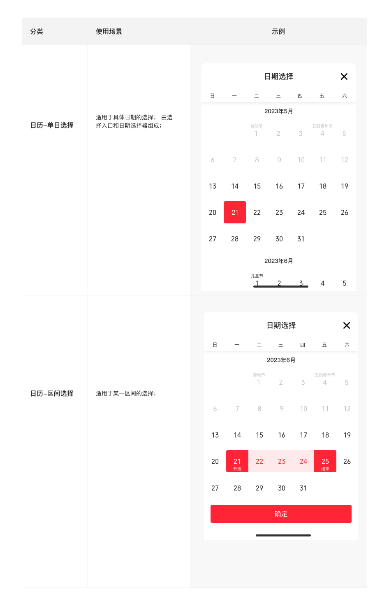

# 日历（Calendar）

## Overview

日历组件提供**单日选择**与**区间选择**两种模式，配套**选择入口**触发控件。整体以 Bottom Sheet 形式呈现，不单独作为页面存在。

**设计师：** 陈亮  
**设计来源帧：** `Calendar 日历`

---

## 组件构成

```
日历（Calendar）
├── 选择入口（Trigger）
│   ├── 01 标题行内           标题 + 日期选择框，右侧对齐
│   └── 02 前后日切换导航条   左右箭头 + 中间日期框，用于逐日翻页
└── 日历选择器（Picker）      Bottom Sheet 内嵌日历
    ├── 单日选择
    └── 区间选择
        ├── 短期范围（同月）
        └── 跨月范围
```

---

## 选择入口（Trigger）

### 01 标题行内

用于表单/设置页等场景，将标题文字与日期选择框放置在同一行。

| 属性 | 值 | Token |
|---|---|---|
| 容器尺寸 | 375 × 54px | — |
| 标题字体 | PingFang SC Medium 18px | `font-family-ios-cn` / `font-weight-medium` |
| 标题颜色 | `#323232`（≈`rgba(0,0,0,0.84)`） | `color-text-primary` |
| 标题对齐 | 左对齐，x = 16px | `margin-loose` |
| 日期选择框背景 | `#F6F6F6` | —（无对应 token，最近似 `color-background-layer1` `#F5F5F5`） |
| 日期选择框尺寸 | 137 × 32px | — |
| 日期选择框圆角 | 4px | `radius-small` |
| 日历图标 | `1图标/线性/A10 日历`，15 × 15px | — |
| 日期文字字体 | THS JinRongTi Medium 16px | `font-family-number` / `font-weight-medium` |
| 日期文字颜色 | `rgba(0,0,0,0.84)` | `color-text-primary` |
| 日期格式 | `YYYY-MM-DD` | — |

### 02 前后日切换导航条

用于需要逐日前进/后退的场景（如日报、K 线等），左右箭头点击切换相邻日期。

| 属性 | 值 | Token |
|---|---|---|
| 容器尺寸 | 375 × 48px | — |
| "上一日"文字字体 | PingFang SC Regular 14px | `font-family-ios-cn` |
| "上一日"文字颜色 | `rgba(0,0,0,0.84)` | `color-text-primary` |
| 左箭头尺寸 | 16 × 16px，x = 16px | — |
| 右箭头（镜像翻转） | 16 × 16px，x = 359px | — |
| 日期选择框 | 同「标题行内」规格（宽 137px，高 32px） | — |
| 日期选择框位置 | 居中，x ≈ 119px | — |

---

## 日历选择器（Picker）

以 Bottom Sheet 形式弹出，内部依次由上至下：标题栏 → 周期行 → 年月行 → 日期格 → 按钮区 → 安全区。

### 标题栏

复用 `底部弹窗/04标题组合/04单行标题+关闭`。

| 属性 | 值 | Token |
|---|---|---|
| 高度 | 64px | — |
| 顶部圆角 | 10px | — |
| 背景 | `#FFFFFF` | `color-foreground-layer1` |
| 标题文字 | "日期选择"，PingFang SC Medium 18px | `font-family-ios-cn` / `font-weight-medium` |
| 标题颜色 | `rgba(0,0,0,0.84)` | `color-text-primary` |
| 标题对齐 | 水平居中 | — |
| 关闭按钮图标 | `1图标/线性/5A-03错24`，24px | — |
| 关闭按钮位置 | 右侧，x = 16px from right | — |

### 周期行（星期头）

| 属性 | 值 | Token |
|---|---|---|
| 高度 | 30px | — |
| 背景 | `#FFFFFF` | `color-foreground-layer1` |
| 阴影 | `0px 2px 10px rgba(125,126,128,0.16)` | — |
| 列文字 | 日 / 一 / 二 / 三 / 四 / 五 / 六 | — |
| 字体 | PingFang SC Regular 12px | `font-family-ios-cn` / `font-weight-regular` |
| 文字颜色 | `rgba(0,0,0,0.84)` | `color-text-primary` |
| 对齐 | 每列居中 | — |
| 列宽 | 54px（「日」列 53px） | — |

### 年月行

| 属性 | 值 | Token |
|---|---|---|
| 高度 | 44px | — |
| 背景 | `#FFFFFF` | `color-foreground-layer1` |
| 文字格式 | `YYYY年M月`，例如 "2023年6月" | — |
| 字体 | PingFang SC Medium 14px | `font-family-ios-cn` / `font-weight-medium` |
| 文字颜色 | `rgba(0,0,0,0.84)` | `color-text-primary` |
| 对齐 | 水平居中 | — |

### 日期格

每行高 64px，每列宽 54px（共 7 列，总宽 375px = 7 × 53.57px，实际约 54px）。

| 元素 | 字体 | 字号 | 颜色 | Token |
|---|---|---|---|---|
| 日期数字（本月） | THS JinRongTi Regular | 16px | `rgba(0,0,0,0.84)` | `font-family-number`, `color-text-primary` |
| 日期数字（跨月灰化） | THS JinRongTi Regular | 16px | `rgba(0,0,0,0.24)` | `font-family-number`, `color-text-quaternary` |
| 节假日标签 | PingFang SC Regular | 10px | `rgba(0,0,0,0.84)` | `font-family-ios-cn`, `color-text-primary` |

> 节假日标签位于日期数字上方，垂直 y 偏移约 −16px，优先显示重要节假日名称（如"劳动节"、"儿童节"、"五四青年节"）。

---

## 日期选中状态

### 单日选中

| 属性 | 值 | Token |
|---|---|---|
| 选中背景 | 54 × 54px，圆角 4px，`#2E58FF` | `color-brand-primary` |
| 选中日期文字颜色 | `#FFFFFF` | `color-text-inverse` |
| "开始"/"结束"标签 | `font-family-ios-cn` `font-weight-regular` 10px，白色，日期数字下方 | `font-family-ios-cn`, `color-text-inverse` |

### 区间选中

| 元素 | 背景色 | 圆角 | Token |
|---|---|---|---|
| 开始日期格 | `#2E58FF` | 左侧圆角 4px，右侧 0 | `color-brand-primary` |
| 结束日期格 | `#2E58FF` | 右侧圆角 4px，左侧 0 | `color-brand-primary` |
| 区间内日期格 | `rgba(46,88,255,0.1)` | 0 | `color-background-brand-weak` |
| 区间内日期文字 | `#2E58FF` | — | `color-brand-primary` |

> 开始/结束格日期数字与"开始"/"结束"标签均为白色。

---

## 按钮区

复用 `底部弹窗/05按钮组合/02单按钮_确定`，高度 60px。

| 状态 | 按钮文字 | 按钮背景 | 文字颜色 | Token |
|---|---|---|---|---|
| 激活（已选择结束日期） | 确定 | `#2E58FF` | `#FFFFFF` | `color-brand-primary`, `color-text-inverse` |
| 禁用（等待选择结束日期） | 请选择结束时间 | `rgba(46,88,255,0.5)` | `rgba(255,255,255,0.4)` | `color-background-disabled` |

> 单日选择模式：选择日期后按钮即激活。区间选择模式：仅选择开始日时按钮禁用，选择结束日后激活。

按钮规格：343 × 44px，左右 margin 16px，圆角 4px。

---

## 安全区

| 属性 | 值 | Token |
|---|---|---|
| 安全区高度 | 34px，背景白色 | `color-foreground-layer1` |
| Home indicator 尺寸 | 134 × 5px | — |
| Home indicator 颜色 | `#333333` | — |
| Home indicator 圆角 | 100px | — |
| Home indicator 位置 | 水平居中，距底部 9px | — |

---

## Icon Usage

| 用途 | Figma 组件名 | SVG 文件 |
|---|---|---|
| 日历触发图标 | `1图标/线性/A10 日历` | `assets/icons/actions/calendar.svg` |
| 向左（上一日/上一月） | `1图标/线性/1A-021 箭头-左24` | `assets/icons/arrows/arrow-left-24.svg` |
| 向右（下一日/下一月）| 同上，水平翻转 | `assets/icons/arrows/arrow-right-24.svg` |
| 关闭 Bottom Sheet | `1图标/线性/5A-03错24` | `assets/icons/actions/close-24.svg` |

---

## Constraints / Do & Don't

| | 规则 |
|---|---|
| ✅ | 日期数字使用 `font-family-number`（THS JinRongTi），节假日/星期标签使用 `font-family-ios-cn`（PingFang SC） |
| ✅ | 选中状态使用 `color-brand-primary`（`#2E58FF`）；区间填充使用 `color-background-brand-weak`（`rgba(46,88,255,0.1)`） |
| ✅ | 跨月灰化日期使用 `color-text-quaternary`（`rgba(0,0,0,0.24)`） |
| ✅ | Bottom Sheet 关闭按钮固定在右上角，不可省略 |
| ✅ | 区间开始格左圆角、结束格右圆角，中间格无圆角，保持视觉连续 |
| ✅ | 按钮未激活时使用 `color-background-disabled`（`rgba(46,88,255,0.5)`），不得直接隐藏按钮 |
| ❌ | 不要在日期格内对日期数字使用 `font-family-ios-cn` |
| ❌ | 不要让日期格高度随节假日标签内容自动撑高（固定 64px） |
| ❌ | 不要省略跨月日期（灰化显示，保持格局完整） |

---

## Examples


