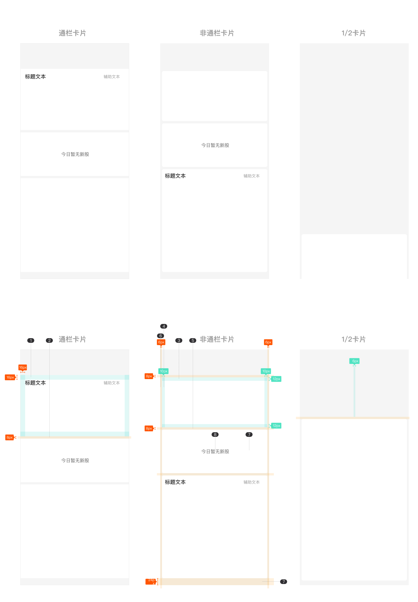

# 卡片（Card）

## Overview

卡片是将相关信息组合在同一容器中的展示组件，常用于首页模块、资讯列表、行情快览等场景。一张卡片通常包含：标题区（标题文本 + 辅助文本）、图片/媒体区、内容区，以及可选的缺省态。

---

## 组件类型（Component Types）

根据宽度布局分为三种：

| 类型 | 宽度 | 外边距 | 适用场景 |
|---|---|---|---|
| 通栏卡片 | 375px（全屏宽） | 无 | 主模块、全宽资讯 |
| 非通栏卡片 | 363px | 左右各 6px | 有圆角的模块卡片 |
| 1/2 卡片 | ~(375px - 外边距 × 2) / 2 | 左右各 6px | 两列并排展示 |

---

## 结构

```
[ 标题区：标题文本（左） + 辅助文本（右） ]
[ 图片 / 媒体区                            ]
[ 内容区（数据行、列表等）                  ]
```

---

## 尺寸规范

### 通栏卡片

| 属性 | 值 | Token |
|---|---|---|
| 宽度 | 375px | — |
| 左右内边距 | 16px | `padding-extra-loose` |
| 上下内边距（标题区） | 16px | `padding-extra-loose` |
| 圆角 | 无 | — |

### 非通栏卡片

| 属性 | 值 | Token |
|---|---|---|
| 宽度 | 363px（375 - 6 × 2） | — |
| 外边距（左右） | 6px | — ¹ |
| 左右内边距 | 10px | — ² |
| 上下内边距（标题区） | 12px | — ³ |
| 圆角 | 8px | `radius-extra-large` |

> ¹ 6px 无对应 spacing token，直接使用原始值。
> ² 10px 无对应 spacing token，直接使用原始值。
> ³ 12px 无对应 spacing token，直接使用原始值。

### 1/2 卡片

| 属性 | 值 | Token |
|---|---|---|
| 每格宽度 | (375 - 6 × 2 - 间距) / 2 | — |
| 外边距（左右） | 6px | — |
| 圆角 | 8px | `radius-extra-large` |

---

## 标题区（Card Header）

标题文本左对齐，辅助文本右对齐，二者处于同一行。

| 元素 | 字号 | 行高 | 字重 | 颜色 | Token |
|---|---|---|---|---|---|
| 标题文本 | 18px | 22px | Medium | `rgba(0,0,0,0.84)` | `color-text-primary` |
| 辅助文本 | 14px | 18px | Regular | `rgba(0,0,0,0.40)` | `color-text-tertiary` |

---

## 颜色规范

| 属性 | 值 | Token |
|---|---|---|
| 卡片背景色 | 白色 | `color-foreground-layer1` |
| 页面背景色（卡片所在） | `#f5f5f5` | `color-background-weak` |

---

## 缺省态（Empty State）

内容区无数据时，使用缺省图组件 `缺省图/03模块/01纯文本`。

| 属性 | 值 | Token |
|---|---|---|
| 区域高度 | 150px | — |
| 文字字号 | 16px | `font-size-base` |
| 文字颜色 | `rgba(0,0,0,0.6)` | `color-text-secondary` |

---

## 底部安全区

在带有底部 Home 指示条的设备上，页面底部需预留 **24px** 安全距离，避免内容被遮挡。

---

## Constraints / Do & Don't

| | 规则 |
|---|---|
| ✅ | 全宽场景使用通栏卡片，有间距/圆角需求时使用非通栏卡片 |
| ✅ | 标题文本左对齐，辅助文本右对齐 |
| ✅ | 非通栏卡片必须配合 8px 圆角 |
| ✅ | 内容区无数据时，使用缺省态组件（高度 150px） |
| ✅ | 页面底部预留 24px 安全区 |
| ❌ | 不要在通栏卡片上添加圆角 |
| ❌ | 不要在同一页面中混用通栏与非通栏（保持布局一致性） |
| ❌ | 不要硬编码外边距或内边距，使用规范值（6 / 10 / 12 / 16px） |

---

## Examples


