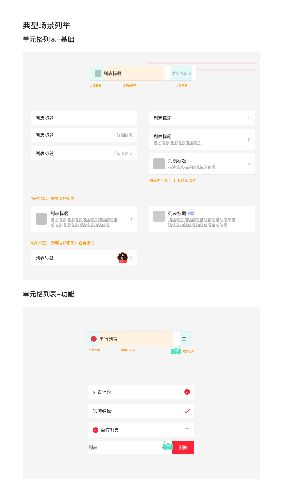

# 单元格列表（Cell List）

## Overview

列表是以一定秩序排列信息单元的集合。单行单元格列表单个列表项中包含 1 行标题；如需多行内容，可使用含描述信息的双行变体。

**设计师：** 武涵

---

## 组件类型（Component Types）

| 分类 | Figma 前缀 | 使用场景 |
|---|---|---|
| 基础（展示型） | `Cell:01单元格列表-基础` | 非编辑态展示，如查看活动详情、展示配置项当前值 |
| 功能型 | `Cell:02单元格列表-选择` | 含交互操作，如开关、单选、多选 |

---

## 结构

单元格由三个区域组成：**左侧元素**（可选）+ **标题内容区**（弹性）+ **右侧元素**（可选）

```
|← 16px →| [左侧元素 ~32px] [8px] [标题内容区 flex] [24px min] [右侧元素] |← 16px →|
```

整行使用 `justify-between` 布局，左侧内容组与右侧元素组分别各占一端。

---

## 尺寸规范

| 属性 | 值 | Token |
|---|---|---|
| 行高（单行） | 52px | — |
| 行高（标题 + 描述信息） | 74px | — ¹ |
| 行高（标题 + 标签 + 多行描述信息） | 92px | — ¹ |
| 左右内边距 | 16px | `padding-extra-loose` |
| 上下内边距 | 16px | `padding-extra-loose` |
| 分割线粗细 | 0.5px | `sizing-border-extra-small` |

> ¹ 高度由内容撑开（`16px 上边距 + 标题行高 + gap + 描述行高 + 16px 下边距`），非固定值，随内容自适应。

---

## 颜色规范

| 属性 | 值 | Token |
|---|---|---|
| 背景色 | 白色 | `color-foreground-layer1` |
| 分割线颜色 | `rgba(0,0,0,0.08)` | `color-divider` |

---

## 文字规范

| 属性 | 值 | Token |
|---|---|---|
| 标题字号 | 16px | `font-size-base` |
| 标题行高 | 20px | `line-height-base` |
| 标题字重 | Regular (400) | `font-weight-regular` |
| 标题文字色 | `rgba(0,0,0,0.84)` | `color-text-primary` |
| 描述信息字号 | 14px | `font-size-medium` |
| 描述信息行高 | 18px | `line-height-medium` |
| 描述信息文字色 | `rgba(0,0,0,0.40)` | `color-text-tertiary` |
| 标题与描述信息间距 | 4px | — |
| 右侧副文字字号 | 14px | `font-size-medium` |
| 右侧副文字行高 | 18px | `line-height-medium` |
| 右侧副文字色 | `rgba(0,0,0,0.40)` | `color-text-tertiary` |

---

## 左侧元素

| 元素类型 | 尺寸 | 说明 |
|---|---|---|
| 无 | — | 标题直接从左边距 16px 起始 |
| 线性图标 | 24×24px | 功能性图标，与标题右侧保持 8px 间距 |
| 头像 | 40×40px | 支持叠加直播状态角标 |

---

## 右侧元素

| 元素类型 | 尺寸 | 适用场景 |
|---|---|---|
| 箭头（→） | 16×16px | 导航跳转，图标 `2A-022 箭头-右24` |
| 副文字 + 箭头 | — | 展示当前值并支持跳转 |
| 开关（Switch） | 52×32px | 功能型：开关控制 |
| 单选选中态（✓） | 20×20px | 特殊单选列表选中态，图标 `单选/02特殊单选/01已选中` |
| 分段式控件 | 弹性宽度 | 特殊配置场景（如三段选择） |
| 标签（Tag） | — | 见 [Tag 组件规范](tag.md) |

---

## 编辑/排序模式

列表支持编辑态，进入编辑后每行变化如下：

| 区域 | 元素 | 说明 |
|---|---|---|
| 左侧 | 减号圆圈图标（C12 减-圆圈-填充） | 20×20px，点击触发删除确认 |
| 右侧 | 拖拽手柄（B45 菜单） | 16×16px，长按拖动排序 |

**侧滑删除**：非编辑模式下，向左滑动列表行可从右侧露出「删除」操作区（宽约 80px），文字 `删除`，背景红色。

---

## 特殊情况

| 情景 | 说明 |
|---|---|
| 右侧多元素组合 | 右侧可配置分段式控件配合图标（如设置图标 + 分段式控件）；注意配置约束 |
| 归属关系（父子层级） | 支持配置子单元格缩进，表达层级归属关系 |
| 头像直播态 | 头像左下角叠加直播角标（「直播中」徽章） |

---

## Constraints / Do & Don't

| | 规则 |
|---|---|
| ✅ | 纯展示场景使用基础型（`Cell:01`），含交互操作使用功能型（`Cell:02`） |
| ✅ | 右侧有跳转/操作入口时，使用箭头（→）图标 |
| ✅ | 左侧元素、右侧元素均与行垂直居中对齐 |
| ❌ | 开关（Switch）与箭头（→）不得同时出现在同一行右侧 |
| ❌ | 设置图标（⚙）与箭头（→）不得同时出现在同一行右侧 |
| ❌ | 选项选择场景下，右侧不得放置描述/详情文字（保持选项简洁） |

---

## Examples


