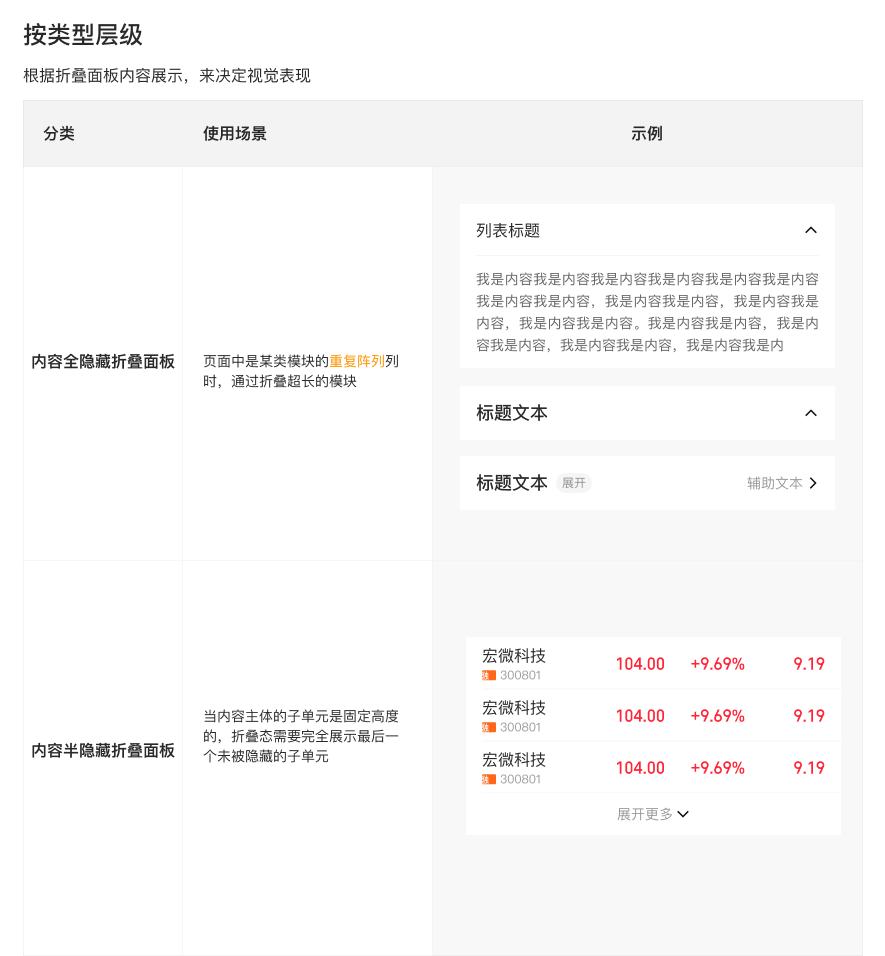

# Collapse 折叠面板

## 定义

折叠面板可以将次级的、过长的、辅助的信息进行折叠，以展示全局分类或页面余下的信息。

**适用场景：**
- 页面底部有比较重要的内容被超长内容阻隔时，通过折叠面板节省空间，以展示余下内容
- 页面中是某类模块的重复阵列时，通过折叠超长的模块，保持页面统一整洁

**设计师：** 陈亮

---

## 组件类型

根据折叠面板内容展示方式分为三类。

### 01 内容全隐藏折叠面板

折叠态下，所有内容完全隐藏，仅显示标题栏（或展开行）。

**使用场景：** 页面中是某类模块的重复阵列时，折叠超长模块，保持页面整洁。

**关键规则：**
- 当内容主体的子单元是固定高度时，折叠态需完整显示最后一个可见子单元（不可截断）
- 展开按钮居中显示在内容区底部

### 02 内容半隐藏折叠面板

折叠态下，内容底部以渐变遮罩（white → transparent）遮盖，隐去尾部。

**使用场景：** 内容子单元高度不可控时（如长文本、图片），通过渐变隐去底部内容。

**关键规则：**
- 折叠态：箭头朝下，箭头左侧可配置文案
- 原则上不建议提供展开态的收起操作
- 若必须引入收起操作，在展开态内容底部提供朝上的箭头，箭头左侧可配置文案
- 若展开后内容需滑动才能浏览完毕，需设置点击「收起」后的页面锚点位置

**子类型 — 子单元内容显示不全：**
- 子单元高度不可控时，渐变遮罩覆盖末尾子单元；展开态可配置「关注作者，阅读全文」等自定义 CTA

### 03 轻量文字折叠面板

适用于纯文本段落的折叠，无单独标题栏。

**关键规则：**
- 原则上不建议提供展开态的收起操作
- 若必须引入收起操作，则在展开态内容底部放置朝上箭头，箭头左侧可配置文案

---

## 标题栏规格（模块折叠面板）

| 属性 | 规格 |
|---|---|
| 容器尺寸 | 375×54px |
| 背景色 | `color-foreground-layer1` `#FFFFFF` |
| 标题字体 | `font-family-ios-cn` `font-weight-medium` · 18px · leading 22px |
| 标题颜色 | `color-text-primary` `rgba(0,0,0,0.84)` |
| 辅助文本字体 | `font-family-ios-cn` `font-weight-regular` · 14px · leading 18px |
| 辅助文本颜色 | `color-text-tertiary` `rgba(0,0,0,0.4)` |
| 展开/收起图标 | `图标/线性/3A-023箭头-下24` · 24×24px |
| 图标位置 | 右侧，距右边缘 16px |
| 底部分割线 | `color-divider` `rgba(0,0,0,0.08)` · 0.5px |

**展开/收起图标状态：**
- 折叠态：箭头朝下（默认）
- 展开态：旋转 180°（箭头朝上）

---

## 模块折叠面板变体

### 标准（展开按钮在右侧）

展开/收起箭头（24×24px）固定在标题栏右侧。

### 右侧被占位（展开按钮在左侧）

当标题栏右侧被更高优先级的操作/入口占用时，将展开按钮移至标题栏左侧。

| 属性 | 规格 |
|---|---|
| 胶囊背景 | `color-background-weak` `rgba(0,0,0,0.04)` · 圆角 10px |
| 展开文案 | `font-family-ios-cn` `font-weight-regular` · 12px · `color-text-tertiary` `rgba(0,0,0,0.4)` |
| 展开图标 | `图标/线性/2A-022箭头-右24` · 24×24px |
| 图标位置 | 左侧，胶囊内与文案并排 |

---

## 展开按钮行规格（全隐藏类型）

| 属性 | 规格 |
|---|---|
| 高度 | 42px |
| 文案 | 「展开更多」`font-family-ios-cn` `font-weight-regular` · 14px · `color-text-tertiary` `rgba(0,0,0,0.4)` |
| 图标 | `图标/线性/3A-023箭头-下24` · 24×24px |
| 布局 | 文案与图标水平居中排列 |

---

## 轻量文字折叠面板规格

| 属性 | 规格 |
|---|---|
| 正文字体 | `font-family-ios-cn` `font-weight-regular` · 14px · leading 22px |
| 正文颜色 | `color-text-primary` `rgba(0,0,0,0.84)` |
| 「展开」/「收起」文字 | `font-family-ios-cn` `font-weight-regular` · 14px · `color-text-link` `#4167D9` |
| 「展开」/「收起」位置 | 内容末尾右侧 |

---

## 典型场景构成

### 单元列表内容全隐藏折叠面板

复用 `单元格列表` 行（CellList 52px 行高）+ 展开按钮行。

```
折叠态：
├── 标题行（CellList 行，含右侧折叠箭头）
│   └── 内容区（全部 CellList 行，全部隐藏）
└── 展开按钮行（42px，「展开更多」+ 箭头-下24）

展开态：
├── 标题行
│   └── 内容区（全部 CellList 行，全部显示）
└── （无展开按钮）
```

### 模块折叠面板-标准

```
折叠态：
└── 标题栏（54px，标题 + 右侧收起/展开箭头）

展开态：
├── 标题栏（54px）
│   └── 内容区（自由高度，文本/卡片等）
└── 底部分割线（0.5px）
```

### 模块折叠面板-右侧被占位

```
折叠态：
└── 标题栏（54px，左侧胶囊展开按钮 + 标题）

展开态：
├── 标题栏（54px）
│   └── 内容区（自由高度）
```

### 内容半隐藏折叠面板-子单元内容显示不全

```
折叠态：
├── 内容区（固定高度截断，底部渐变遮罩 white→transparent）
└── 展开行（箭头-下24 + 文案，居中）

展开态：
├── 内容区（完整显示）
└── 收起行（箭头-下24 旋转 180° + 文案，居中）
```

---

## Icon Usage

| 用途 | Figma 组件名 | SVG 文件 |
|---|---|---|
| 展开/收起（默认，右侧） | `1图标/线性/3A-023箭头-下24` | `assets/icons/arrows/arrow-down-24.svg` |
| 展开按钮（右侧被占位，左侧胶囊内） | `1图标/线性/2A-022箭头-右24` | `assets/icons/arrows/arrow-right-24.svg` |

---

## 设计约束 (Do & Don't)

✅ 展开态图标为箭头-下24 旋转 180°（向上），不可单独引入「箭头-上」图标替代  
✅ 内容全隐藏折叠面板——子单元固定高度时，折叠态须完整展示最后一个可见子单元  
✅ 内容半隐藏折叠面板——渐变遮罩必须保留，不可直接截断内容  
✅ 右侧被占位变体——展开按钮必须带胶囊背景与文案，不可仅使用裸箭头图标  
✅ 标题栏底部分割线使用 `color-divider`，不可省略  
❌ 半隐藏折叠面板默认不提供收起操作；确有需要时，须设置收起后的页面锚点  
❌ 轻量文字折叠面板「展开」/「收起」链接颜色固定使用 `color-text-link`（`#4167D9`），不可替换为品牌红色  
❌ 不可将「内容全隐藏」与「内容半隐藏」混用于同一组折叠面板中

---

## Examples


