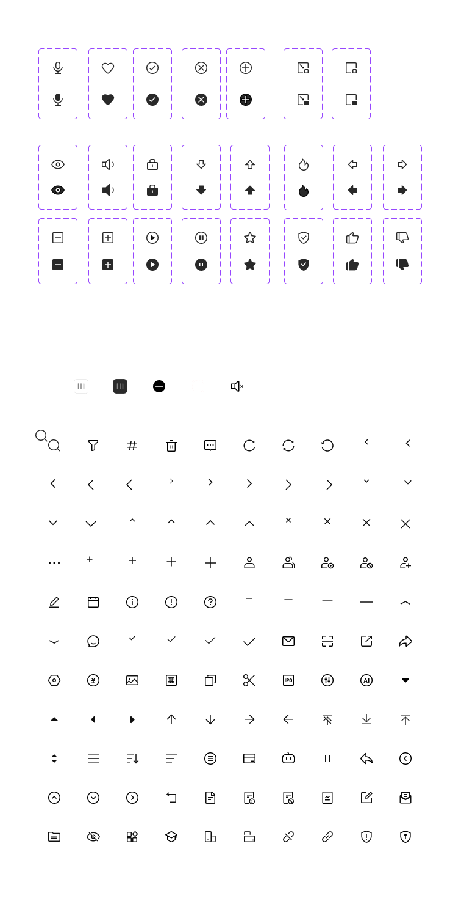

# Icon

## Overview

All icons are stored as SVG files under `assets/icons/`, organized into five category directories. SVGs are read directly — no MCP or Figma access required at runtime.

**Default size:** 24×24px viewBox  
**Color:** Black (`#0F0F0F` or `black` with `fill-opacity: 0.84`)  
**Usage:** Reference the SVG path directly in code, or inline the SVG content.

---

## Naming Convention

| Pattern | Example | Meaning |
|---|---|---|
| `icon-name.svg` | `search.svg` | Single-state icon |
| `icon-name-{size}.svg` | `arrow-left-24.svg` | Multi-size icon (12/16/20/24) |
| `icon-name-fill.svg` | `heart-fill.svg` | Filled (面性=on) variant |
| `icon-name-outline.svg` | `heart-outline.svg` | Outline (面性=off) variant |
| `icon-name-dark.svg` | `slider-dark.svg` | Dark-theme variant |

---

## Fill / Outline Variants

Icons with a `面性` (fill style) property in Figma have two variants:

- **`-fill`** — solid/filled shape, stronger visual weight
- **`-outline`** — stroked shape, lighter visual weight

Use `-fill` for selected/active states. Use `-outline` for default/inactive states.

---

## Category Index

### arrows/

Direction and navigation arrows.

| File | Description |
|---|---|
| `arrow-left-12/16/20/24.svg` | Left arrow, 4 sizes |
| `arrow-right-12/16/20/24.svg` | Right arrow, 4 sizes |
| `arrow-down-12/16/20/24.svg` | Down arrow, 4 sizes |
| `arrow-up-12/16/20/24.svg` | Up arrow, 4 sizes |
| `nav-back.svg` | Navigation back (filled circle style) |
| `arrow-collapse-up.svg` | Collapse upward |
| `arrow-expand-down.svg` | Expand downward |
| `arrow-fill-down/up/left/right.svg` | Solid fill triangle arrows |
| `arrow-line-up/down/right/left.svg` | Line-style arrows |
| `arrow-top.svg` | Scroll-to-top arrow |
| `arrow-bottom.svg` | Scroll-to-bottom arrow |
| `arrow-top-disabled.svg` | Disabled scroll-to-top |
| `sort-arrow.svg` | Sort indicator arrow |
| `arrow-circle-left/up/down/right.svg` | Circle-enclosed arrows |

---

### actions/

General UI actions, controls, and state icons.

**Single-state:**

| File | Description |
|---|---|
| `search.svg` | Search/magnifier |
| `filter.svg` | Filter |
| `edit.svg` | Edit (pencil) |
| `edit-2.svg` | Edit variant II |
| `calendar.svg` | Calendar/date picker |
| `info.svg` | Info (circle-i) |
| `alert.svg` | Alert/exclamation |
| `help-list.svg` | Help list |
| `email.svg` | Email/envelope |
| `scan.svg` | QR/barcode scan |
| `share-nav.svg` | Share (nav bar) |
| `settings.svg` | Settings/gear |
| `trash.svg` | Delete/trash |
| `topic.svg` | Topic/hashtag |
| `more.svg` | More options (ellipsis) |
| `menu.svg` | Menu/hamburger |
| `menu-2.svg` | Menu in circle |
| `sort.svg` | Sort |
| `align-left.svg` | Left-align text |
| `refresh.svg` | Refresh/reload |
| `sync.svg` | Sync |
| `undo.svg` | Undo |
| `eye-closed.svg` | Hidden/password eye |
| `minus-circle-fill.svg` | Remove (circle minus, filled) |
| `text.svg` | Text indicator |
| `text-warning.svg` | Text with warning |
| `text-disabled.svg` | Disabled text |
| `text-analysis.svg` | Text analysis |
| `music-pause-2.svg` | Music pause (bare, no circle) |
| `slider.svg` | Slider handle (light bg) |
| `slider-dark.svg` | Slider handle (dark bg) |
| `image.svg` | Image/photo |
| `feedback.svg` | Feedback/suggestion box |
| `folder.svg` | Folder |
| `rotate-portrait.svg` | Rotate to portrait |
| `rotate-landscape.svg` | Rotate to landscape |
| `link.svg` | Link/chain |
| `link-broken.svg` | Broken link |
| `safety-warning.svg` | Shield with warning |
| `safety-lock.svg` | Shield with lock |
| `trim.svg` | Trim/scissors (video editing) |
| `window-float-b.svg` | Floating window B variant |

**Multi-size (12/16/20/24):**

| File | Description |
|---|---|
| `close-{size}.svg` | Close/×, 4 sizes |
| `plus-{size}.svg` | Plus/add, 4 sizes |
| `minus-{size}.svg` | Minus/remove, 4 sizes |
| `check-{size}.svg` | Checkmark, 4 sizes |

**Fill / Outline pairs:**

| Base name | Fill | Outline | Description |
|---|---|---|---|
| `speaker` | `speaker-fill.svg` | `speaker-outline.svg` | Speaker/volume on |
| `lock` | `lock-fill.svg` | `lock-outline.svg` | Lock |
| `fire` | `fire-fill.svg` | `fire-outline.svg` | Fire/hot |
| `safety-pass` | `safety-pass-fill.svg` | `safety-pass-outline.svg` | Shield with checkmark |
| `star` | `star-fill.svg` | `star-outline.svg` | Star/favorite |
| `music-pause` | `music-pause-fill.svg` | `music-pause-outline.svg` | Pause in circle |
| `music-play` | `music-play-fill.svg` | `music-play-outline.svg` | Play in circle |
| `add` | `add-fill.svg` | `add-outline.svg` | Add in square |
| `minus` | `minus-fill.svg` | `minus-outline.svg` | Minus in square |
| `window-float` | `window-float-fill.svg` | `window-float-outline.svg` | Floating window |
| `window-minimize` | `window-minimize-fill.svg` | `window-minimize-outline.svg` | Minimize window |
| `microphone` | `microphone-fill.svg` | `microphone-outline.svg` | Microphone |
| `correct` | `correct-fill.svg` | `correct-outline.svg` | Checkmark in circle |
| `miniapp-close` | `miniapp-close-fill.svg` | `miniapp-close-outline.svg` | Mini-app close (× in circle) |
| `add-circle` | `add-circle-fill.svg` | `add-circle-outline.svg` | + in circle |
| `eye` | `eye-fill.svg` | `eye-outline.svg` | Eye/visible |

**Single-state (speaker off):**

| File | Description |
|---|---|
| `speaker-off.svg` | Muted speaker |

---

### users/

User identity and group icons.

| File | Description |
|---|---|
| `user.svg` | Single user |
| `user-group.svg` | User group |
| `user-account.svg` | User account |
| `user-disabled.svg` | Disabled user |
| `user-add.svg` | Add user |
| `student.svg` | Student (graduation cap / school) |

---

### social/

Social interaction icons.

**Single-state:**

| File | Description |
|---|---|
| `chat.svg` | Chat bubble A |
| `chat-2.svg` | Chat bubble B |
| `forward.svg` | Forward/share A |
| `forward-2.svg` | Forward/share B |

**Fill / Outline pairs:**

| Base name | Fill | Outline | Description |
|---|---|---|---|
| `heart` | `heart-fill.svg` | `heart-outline.svg` | Heart/like |
| `like` | `like-fill.svg` | `like-outline.svg` | Thumbs up |
| `dislike` | `dislike-fill.svg` | `dislike-outline.svg` | Thumbs down |

---

### finance/

Finance and trading-specific icons.

**Single-state:**

| File | Description |
|---|---|
| `rmb.svg` | RMB / ¥ symbol |
| `buy.svg` | Buy |
| `ipo.svg` | IPO |
| `credit-card.svg` | Credit card |
| `wencai.svg` | 问财 (Wencai branding) |
| `adjust.svg` | Adjust (sliders) |
| `bi.svg` | BI / analytics |

**Fill / Outline pairs (price arrows):**

| Base name | Fill | Outline | Description |
|---|---|---|---|
| `arrow-price-down` | `arrow-price-down-fill.svg` | `arrow-price-down-outline.svg` | Price drop arrow |
| `arrow-price-up` | `arrow-price-up-fill.svg` | `arrow-price-up-outline.svg` | Price rise arrow |
| `arrow-price-left` | `arrow-price-left-fill.svg` | `arrow-price-left-outline.svg` | Price left arrow |
| `arrow-price-right` | `arrow-price-right-fill.svg` | `arrow-price-right-outline.svg` | Price right arrow |

---

## How to Read an Icon SVG

In a future session without Figma access, read any icon directly:

```
Read: design-system/assets/icons/actions/star-fill.svg
```

The file contains a self-contained SVG string ready to paste into HTML/JSX or save as an asset.

To apply a custom color, replace `fill="black"` / `stroke="black"` with a CSS `currentColor` or hex value.

---

## Total Icon Count

| Category | Files |
|---|---|
| arrows | 35 |
| actions | ~80 |
| users | 6 |
| social | 10 |
| finance | 15 |
| **Total** | **~146** |


---

## Examples



