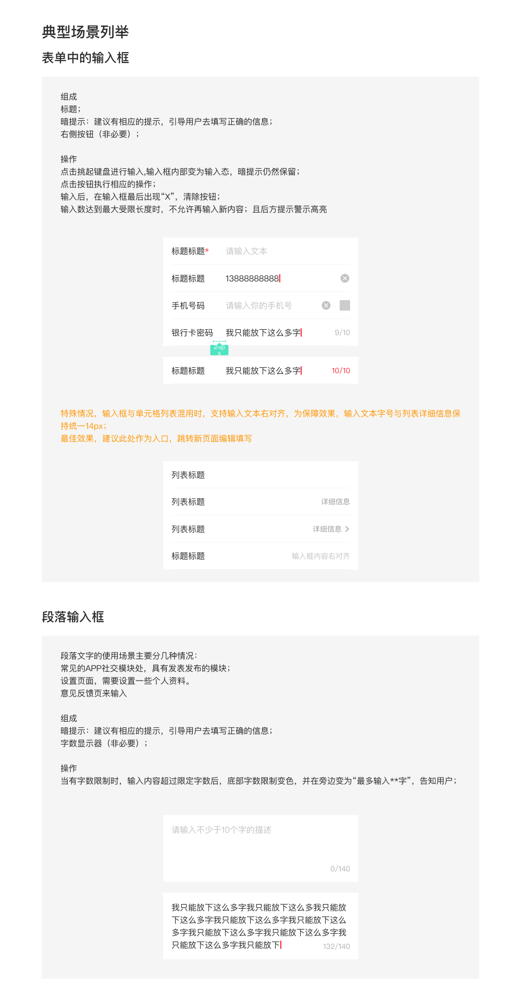

# 输入框（Input / Field）

## Overview

输入框为用户提供一个输入文字、编辑已输入文字的控件。作为页面中主要的数据录入入口，可引导用户录入信息。

**设计师：** 武涵

---

## 组件类型（Component Types）

| 类型 | Figma 前缀 | 使用场景 |
|---|---|---|
| 表单输入框 | `输入框/01基础/` | 表单页中嵌入单元格列表行的输入框，单行 |
| 段落输入框 | — | 社交模块发布、意见反馈、个人资料设置等多行文本输入 |

---

## 表单输入框（单行）

基于单元格列表行的输入框，沿用 Cell List 的行结构：左侧固定标题区 + 右侧弹性输入区。

### 组成

- **标题**：左侧固定宽度，说明输入项名称
- **暗提示（Placeholder）**：引导用户填写正确信息，输入态保留
- **右侧按钮**（可选）：清除按钮、竖线分隔符、字数计数器等

### 尺寸规范

| 属性 | 值 | Token |
|---|---|---|
| 行高 | 52px | — |
| 左右内边距 | 16px | `padding-extra-loose` |
| 标题区宽度 | ~104px（含左侧 16px 内边距） | — |
| 输入区起始位置 | 120px（标题区之后） | — |
| 分割线粗细 | 0.5px | `sizing-border-extra-small` |
| 清除按钮尺寸 | 20×20px | `sizing-square-medium` |

### 颜色规范

| 属性 | 值 | Token |
|---|---|---|
| 背景色 | 白色 | `color-foreground-layer1` |
| 分割线 | `rgba(0,0,0,0.08)` | `color-divider` |
| 分隔竖线（清除+其他元素之间） | `#ccc` | — |

### 文字规范

| 元素 | 字号 | 行高 | 字重 | 颜色 | Token |
|---|---|---|---|---|---|
| 标题 | 16px | 20px | Regular | `rgba(0,0,0,0.84)` | `color-text-primary` |
| 输入内容 | 16px | 20px | Regular | `rgba(0,0,0,0.84)` | `color-text-primary` |
| Placeholder | 16px | 20px | Regular | `rgba(0,0,0,0.24)` | `color-text-quaternary` |
| 字数计数器（正常） | 14px | 18px | Regular | `rgba(0,0,0,0.32)` | — ¹ |
| 字数计数器（达到上限） | 14px | 18px | Regular | `#2E58FF` | `color-brand-primary` |

> ¹ `rgba(0,0,0,0.32)` 介于 `color-text-tertiary`（0.40）与 `color-text-quaternary`（0.24）之间，无对应 token，直接使用原始值。

### 必填标记

在标题文字末尾追加 `*`，颜色为 `#2E58FF`（`color-brand-primary`）。

### 清除按钮

- 图标：`C11 错-圆圈-填充`，20×20px
- 出现时机：输入框内有内容时，在右侧显示；点击清空输入内容
- 与其他右侧元素之间用竖线分隔（`#ccc`）

### 字数限制

- 计数器显示格式：`已输入字数/最大字数`（如 `9/10`、`132/140`）
- 位置：右对齐，显示在输入内容右侧或行内右端
- 正常态：`rgba(0,0,0,0.32)`
- 达到上限（已输入 = 最大）：颜色切换为 `#2E58FF`，不允许继续输入

---

## 段落输入框（多行）

用于需要输入大量文本的场景（社交发布、意见反馈、个人资料设置等）。

### 尺寸规范

| 属性 | 值 | Token |
|---|---|---|
| 最小高度 | 128px | — |
| 左右内边距 | 16px | `padding-extra-loose` |
| 高度 | 随内容自动撑高 | — |

### 文字规范

| 元素 | 字号 | 行高 | 字重 | 颜色 | Token |
|---|---|---|---|---|---|
| 输入内容 | 16px | 24px | Regular | `rgba(0,0,0,0.84)` | `color-text-primary` |
| Placeholder | 16px | 24px | Regular | `rgba(0,0,0,0.24)` | `color-text-quaternary` |
| 字数计数器（正常） | 14px | 18px | Regular | `rgba(0,0,0,0.32)` | — ¹ |
| 字数计数器（达到上限） | 14px | 18px | Regular | `#2E58FF` | `color-brand-primary` |

> 段落输入框行高为 24px，区别于表单输入框的 20px。

### 字数计数器位置

- 位置：输入区底部右侧角，右对齐
- 格式：`已输入/最大`（如 `0/140`、`132/140`）
- 达到上限后同样变红，且在旁边提示「最多输入 N 字」

---

## 特殊情况

### 输入框与单元格列表混用（文本右对齐）

当输入框嵌入单元格列表场景时，输入内容可右对齐排版：

- **输入文字字号改为 14px**（与列表详细信息字号统一）
- 文字颜色：`rgba(0,0,0,0.24)`（Placeholder）/ `rgba(0,0,0,0.84)`（已输入内容）
- 此场景建议仅作跳转入口，点击后跳转新页面进行完整编辑

---

## 交互行为

| 行为 | 说明 |
|---|---|
| 点击输入框 | 唤起键盘，进入输入态；Placeholder 保留直到有输入 |
| 有内容时 | 显示清除按钮（C11 错-圆圈-填充） |
| 点击清除 | 清空输入内容，清除按钮消失 |
| 达到字数上限 | 不允许继续输入；字数计数器变红 |

---

## Constraints / Do & Don't

| | 规则 |
|---|---|
| ✅ | 表单输入框必须提供 Placeholder 引导用户输入 |
| ✅ | 有字数限制时，显示字数计数器 |
| ✅ | 必填项在标题后加 `*` 红色标记 |
| ✅ | 输入框与单元格列表混用时，输入文字改用 14px |
| ✅ | 混用场景建议以跳转入口为主，在新页面编辑 |
| ❌ | 不要在输入框行内右侧同时放多个不相关操作 |
| ❌ | 不要超过 2 行文字（段落输入框不设上限，但需设字数限制） |
| ❌ | 不要硬编码 Placeholder 颜色，使用 `color-text-quaternary` |

---

## Examples

