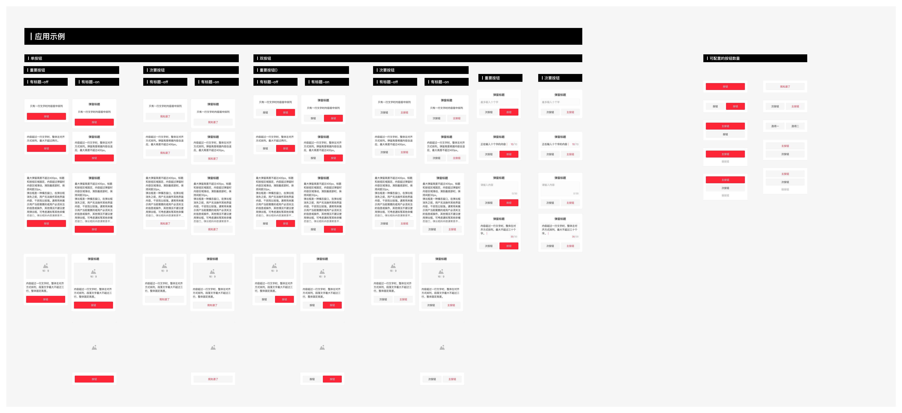

# Modal（模态弹窗）

## Overview

弹窗是一种模态窗口，在弹窗消失之前，用户无法与其他界面元素交互。按场景分为**模态弹窗**（需明确响应）和**非模态弹窗**（可继续操作背景）两大类。

本文档仅覆盖**对话框（Dialog）**这一模态弹窗类型。

**设计师：** 刘勇

---

## 内容类型（Content Type）

组件命名遵循结构：`对话框/[标题状态]/[内容构成]`

| 类型 | Figma 前缀 | 说明 |
|---|---|---|
| 无标题 | `对话框/01强调_无标题` | 无顶部标题行，仅内容 + 按钮 |
| 有标题 | `对话框/02强调_有标题` | 顶部标题 + 内容 + 按钮 |
| 有输入框 | `对话框/03强调_输入框` | 标题 + 输入框 + 按钮 |
| 配图片 | `对话框/04强调_配图片` | 图片（16:9 或自定义）+ 文字 + 按钮 |
| 推广弹窗 | `推广弹窗` | 纯图片内容区 + 底部按钮，分产品向/营销向两种 |

---

## 操作区层级（Button Hierarchy）

操作区样式由**内容引导的重要程度**决定，从高到低共 5 级：

| 层级 | 名称 | 按钮布局 | 场景 |
|---|---|---|---|
| 1 | **醒目-重要** | 单按钮（主按钮，全宽） | 内容具有强力引导性，必须执行 |
| 2 | **醒目-重要 + 次操作** | 双按钮横向（主 + 次并排） | 强引导，但允许用户选择其他操作 |
| 3 | **醒目-重要（竖向）** | 双按钮竖向（主按钮 + 弱按钮文字） | 强引导 + 有大配图，需垂直排列 |
| 4 | **易于察觉-次要** | 单主按钮 或 双按钮横向 | 内容引导性弱，有暗示但非强制 |
| 5 | **可以看到-弱** | 双按钮横向（两侧权重相等） | 无明显引导，用户自主决策 |

### 按钮样式对照

| 按钮 | 样式 | 高度 | 背景色 | Token | 文字色 | Token |
|---|---|---|---|---|---|---|
| 主按钮 | 实底 | 44px | `#2E58FF` | `color-brand-primary` | 白 | `color-text-inverse` |
| 次按钮 | 实底 | 44px | 灰底 | `color-background-weak` | 深色 | `color-text-primary` |
| 弱按钮 | 文字 | 18px | 无 | — | 深色 | `color-text-primary` |

> 全宽按钮宽 248px；双按钮横向排列时各 120px，间距 8px（`margin-base`）。次按钮在左，主按钮在右。

---

## 尺寸规范（Dimensions）

| 属性 | 值 | Token |
|---|---|---|
| 对话框宽度 | 280px | — |
| 圆角（对话框） | 6px | `radius-large` |
| 圆角（按钮区域背景） | 4px | `radius-medium` |
| 最小高度 | 148px | — |
| 最大高度 | 400px | — |
| 自适应高度 | 148px–400px 之间随内容伸缩 | — |

### 高度行为

| 高度状态 | 规则 |
|---|---|
| **最小（148px）** | 只有一行文字时，内容居中排列；无标题 |
| **自适应** | 内容 > 1 行时，整体左对齐；高度随内容增长 |
| **最大（400px）** | 标题和按钮固定在顶/底；中间内容区出现右侧滚动条 |

---

## 内间距（Spacing）

| 位置 | 间距 | Token |
|---|---|---|
| 标题距对话框顶边 | 20px | `margin-extra-loose`¹ |
| 左右内边距 | 16px | `padding-extra-loose` |
| 标题到内容 | 12px | `padding-loose` |
| 内容到按钮区（视觉间距） | 20px | `margin-extra-loose`¹ |
| 按钮区上内边距 | 16px | `padding-extra-loose` |
| 按钮区底部到对话框底边 | 16px | `padding-extra-loose` |
| 双竖向按钮间距 | 10px | `padding-base-loose` |
| 双横向按钮间距 | 8px | `margin-base` |
| 按钮区高度（单/双横向） | 76px（16 + 44 + 16） | — |
| 按钮区高度（双竖向） | 114px（16 + 44 + 10 + 18 + 16）¹ | — |

> ¹ 20px 无对应 `padding-` token；最近匹配为 `margin-extra-loose`（20px）。

---

## 文字规范（Typography）

| 元素 | 字号 | Token | 字重 | Token | 颜色 | Token | 对齐 |
|---|---|---|---|---|---|---|---|
| 标题 | 18px | `font-size-large` | Medium (500) | `font-weight-medium` | `rgba(0,0,0,0.84)` | `color-text-primary` | 居中 |
| 正文（单行） | 16px | `font-size-base` | Regular (400) | `font-weight-regular` | `rgba(0,0,0,0.84)` | `color-text-primary` | 居中 |
| 正文（多行） | 16px | `font-size-base` | Regular (400) | `font-weight-regular` | `rgba(0,0,0,0.84)` | `color-text-primary` | 左对齐 |
| 按钮文字 | 16px | `font-size-base` | Regular (400) | `font-weight-regular` | 白（主）/ 深色（次） | `color-text-inverse` / `color-text-primary` | 居中 |
| 弱按钮文字 | 14px | `font-size-medium` | Regular (400) | `font-weight-regular` | `rgba(0,0,0,0.84)` | `color-text-primary` | 居中 |

---

## 背景蒙层

| 属性 | 值 | Token |
|---|---|---|
| 颜色 + 不透明度 | `rgba(0,0,0,0.60)` | `color-background-mask-level2` |
| 覆盖范围 | 可视屏幕全区域 | — |

---

## 输入框变体（对话框/03强调_输入框）

支持两种输入框形态：

| 形态 | 高度 | 字符数上限提示 |
|---|---|---|
| 单行输入 | 44px | 右对齐显示 `已输/上限`，如 `10/10` |
| 多行输入（最多三行） | 92px | 右下角显示字符计数，如 `0/30` |

- 输入框圆角：4px → `radius-medium`
- 未输入时显示 placeholder 文字，正在输入时显示字符计数
- 按钮区使用双按钮横向（次按钮 + 主按钮）

---

## 配图片变体（对话框/04强调_配图片）

| 形态 | 图片位置 | 图片比例 | 最大高度 |
|---|---|---|---|
| 固定高度（有标题 + 三行文字）| 图片在标题下方、内容上方 | 16:9 | 365px |
| 固定高度（无标题 + 三行文字）| 图片占满顶部 | 16:9 | 327px |
| 自定义内容（无标题）| 图片自定义区域 | 自定义 | 400px |

---

## 推广弹窗（推广弹窗）

| 属性 | 值 | Token |
|---|---|---|
| 宽度 | 280px | — |
| 最大高度 | 400px | — |
| 关闭按钮 | 右上角 × 图标，32×32px 可点击区域 | `sizing-square-large` |
| 用途 | 产品向（功能提示/升级）或营销向（活动/比赛） | — |

---

## Constraints / Do & Don't

| | 规则 |
|---|---|
| ✅ | 根据内容引导的重要程度选择操作区层级（醒目→易于察觉→弱） |
| ✅ | 内容超过一行时使用左对齐，单行内容居中 |
| ✅ | 内容超过 400px 最大高度时，内容区滚动，标题与按钮固定 |
| ✅ | 推广弹窗必须提供关闭入口（× 按钮） |
| ✅ | 双按钮横向时，次按钮在左，主按钮在右 |
| ❌ | 不要为弱引导场景使用全宽主按钮 |
| ❌ | 不要在无标题的最小高度弹窗里塞超过两行的文字（会破坏居中布局）|
| ❌ | 不要超过 400px 而不启用滚动 |

---

## Examples

