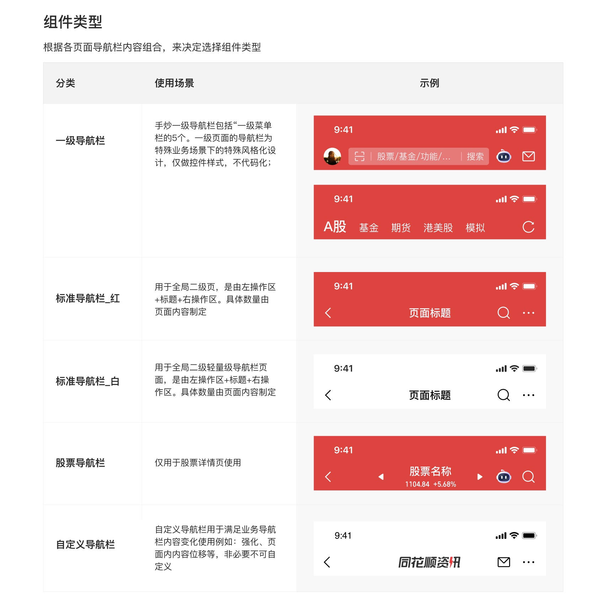

# Navbar 导航栏

设计师：陈亮

## Overview

导航栏位于应用顶端、状态栏之下，提供具有层级关系的界面间导航操作。区分一级页面和二级页面。

**设计原则**
- **一致**：相同或类似场景使用相同布局和控件，确保用户在任何页面都知道如何导航（如二级界面统一用左上角返回按钮）。
- **清晰**：导航路径逻辑简单，用户清楚当前位置及操作后跳转位置。

---

## Variants

| Type | 使用场景 | 背景色 | 是否代码化 |
|---|---|---|---|
| 一级导航栏 | 手炒 App 一级菜单，特殊风格化设计 | 品牌红 | 否（仅控件样式） |
| 标准导航栏_红 | 全局二级页 | `color-background-nav`（红） | 是 |
| 标准导航栏_白 | 全局二级轻量级页面 | `color-foreground-layer1`（白） | 是 |
| 股票导航栏 | 仅用于股票详情页 | 品牌红 | 是 |
| 券商导航栏 | 券商账户相关页面 | 品牌红 | 是 |
| 特殊功能导航栏 | 龙虎榜、融资融券、股票估值等特殊功能 | 品牌红 | 是 |
| 自定义导航栏 | 沉浸式/营销化页面，非必要不使用 | 自定义 | 是 |

---

## 标准导航栏

### 布局

- **12 栅格**：左操作区占 3 / 标题区占 6 / 右操作区占 3
- 槽宽 8px，适配不同屏幕
- 操作区标准为 2 个图标；**3 图标特殊场景**：标题区、操作区各占 4（非特殊不可用）

### 间距规则

| 规则 | 值 |
|---|---|
| 操作区与标题距离 | `8px`（`margin-base`） |
| 操作区内图标间距 | `16px`（`margin-loose`） |
| 标题高度 | `24px`（`sizing-square-base`） |

### 标题约束

- 最多显示 **9 个字**，超出对可读性有害
- 特殊业务超出时支持文字缩小，但非推荐做法

### Figma 组件变体（标准导航栏）

| 变体名 | 右操作区内容 | 红色版 | 白色版 |
|---|---|---|---|
| `01 返回+标题+无图标` | 无 | ✓ | ✓ |
| `02 返回+标题+1图标` | 1 图标 | ✓ | ✓ |
| `03 返回+标题+2图标` | 2 图标 | ✓ | ✓ |
| `04 返回+标题+3图标` | 3 图标（特殊场景） | ✓ | ✓ |
| `05 返回+标题+文字` | 文字（如"帮助"） | ✓ | ✓ |
| `06 返回+标题Tab` | Tab 切换（如要闻/快讯） | ✓ | — |

---

## 股票导航栏

同标准导航栏 12 栅格布局（标题区占 6，左右各占 3）。

- 标题左右切换箭头固定位置，箭头与股票名称安全间距 **8px**
- 页面上滑后，代码区替换为**现价 + 涨幅**
- 显示不下时文字缩小

### Figma 组件变体

| 变体名 | 标题区内容 |
|---|---|
| `01 返回+切换_代码标签+2图标` | 股票名称 + 代码/标签（含切换箭头） |
| `02 返回+切换_涨幅+2图标` | 股票名称 + 现价涨幅（含切换箭头） |
| `03 返回+无切换_代码标签+2图标` | 股票名称 + 代码/标签（无切换箭头） |
| `04 返回+无切换_涨幅+2图标` | 股票名称 + 现价涨幅（无切换箭头） |

---

## 券商导航栏

同标准导航栏布局，标题居中，箭头跟随标题右侧，标题与箭头间距 **8px**。

| 变体名 | 说明 |
|---|---|
| `01 返回+名称+2图标` | 券商名称 + 账号后四位 |

---

## 特殊功能导航栏

用于龙虎榜、融资融券、股票估值等功能，支持导航栏切换股票。标题格式为「股票名称-功能名称」。布局同股票导航栏。

---

## 自定义导航栏

支持沉浸式导航及自定义颜色，支持业务根据内容配置及滑动触发动效。**非必要不可自定义。**

### Figma 组件变体

| 变体名 | 说明 |
|---|---|
| `01 返回+自定义+2图标` | 完全自定义内容区 |
| `02 返回+缩略信息+2图标` | 缩略用户/内容信息 |
| `03 Logo左标题+2图标` | Logo + 标题，红底 |
| `04 Logo左标题+2图标_白` | Logo + 标题，白底 |
| `05 左标题+2图标` | 标题左对齐，红底 |
| `06 左标题+2图标_白` | 标题左对齐，白底 |
| `07 期货详情+3图标` | 期货名称 + 代码/账号 |

---

## Icon Usage

Icons are referenced from `assets/icons/` — no Figma access needed at runtime.

### Figma → SVG Mapping

| Figma Component Name | SVG File | Description |
|---|---|---|
| `图标/1A-111导航菜单返回` | `assets/icons/arrows/nav-back.svg` | Back button (filled circle + left arrow) |
| `图标/10A6搜索` | `assets/icons/actions/search.svg` | Search |
| `图标/6A5 更多` | `assets/icons/actions/more.svg` | More options (ellipsis) |
| `图标/B45 菜单` | `assets/icons/actions/menu.svg` | Side menu / hamburger |
| `图标/A52 邮件` | `assets/icons/actions/email.svg` | Email / message inbox |
| `图标/A9 扫一扫` | `assets/icons/actions/scan.svg` | QR / barcode scan |
| `图标/15A57 刷新` | `assets/icons/actions/refresh.svg` | Refresh market data |

### Icon Slots by Nav Bar Type

Left slot is fixed; right slots fill left → right.

| Nav Bar Type | Left | Right (left → right) |
|---|---|---|
| **一级导航栏** / 首页 | _(none)_ | `scan.svg` · `email.svg` |
| **一级导航栏** / 交易 | _(none)_ | `refresh.svg` |
| **标准导航栏** / 无操作 | `nav-back.svg` | _(none)_ |
| **标准导航栏** / 文字按钮 | `nav-back.svg` | Text button (no icon) |
| **标准导航栏** / 1图标 | `nav-back.svg` | `search.svg` |
| **标准导航栏** / 2图标 | `nav-back.svg` | `search.svg` · `more.svg` |
| **标准导航栏** / 3图标 | `nav-back.svg` | `email.svg` · `search.svg` · `more.svg` |
| **股票导航栏** | `nav-back.svg` | `menu.svg` · `search.svg` · `more.svg` |
| **自定义导航** / 期货 | `nav-back.svg` | `email.svg` · `search.svg` · `more.svg` |
| **自定义导航** / 券商 | `nav-back.svg` | `menu.svg` · `email.svg` · `search.svg` |

### Slot Rules

| Slot | Icon | Rule |
|---|---|---|
| Left | `nav-back.svg` | All secondary / stock / custom nav bars |
| Right-last | `more.svg` | Always the rightmost icon when 2+ right icons (except stock/broker) |
| Right-2nd from right | `search.svg` | Present in most pages with at least 1 right icon |
| Right (additional) | `email.svg` | Only on pages with messaging features (home, 3-icon secondary, broker/futures) |
| Right-special | `scan.svg` | Home page only (一级导航栏/首页) |
| Right-special | `refresh.svg` | Trading page only (一级导航栏/交易) |
| Right (contextual) | `menu.svg` | Stock detail + broker pages — opens a contextual side drawer |

---

## Constraints / Do & Don't

| | 规则 |
|---|---|
| ✅ | 二级页面统一使用标准导航栏（红或白） |
| ✅ | 右侧操作区默认 2 图标，图标间距 16px |
| ✅ | 股票导航栏仅用于股票详情页 |
| ❌ | 标准场景下右操作区不得超过 2 图标 |
| ❌ | 标题超过 9 字不得直接截断，需与设计确认 |
| ❌ | 非营销/沉浸式场景不得使用自定义导航栏 |
| ❌ | 一级导航栏不代码化，不可复用为二级页导航栏 |

## Examples

---

# 小程序导航栏

> TUX 规范。交互：叶戈琦；视觉：王珞燊  
> Figma 组件：`04 小程序导航栏`，属性 `类型=` / `品牌色=on/off`

## 场景定义

根据功能定位，小程序头部分三类。产品与设计人员根据业务定位选择对应样式。

| 类型 | 适用场景 | 典型案例 |
|---|---|---|
| 常规应用导航 | 行情相关功能 | 自选分析 |
| 品牌应用导航 | 投教、资讯、服务；需推广宣传、有订阅/付费功能的应用 | 热股逻辑汇 |
| 运营/第三方应用导航 | 付费运营、活动、游戏类、第三方功能 | 恒科趋势 |

---

## 尺寸规范

| 层 | 高度 | 备注 |
|---|---|---|
| 状态栏（状态栏） | **44px** | padding: top 14px / bottom 12px / left 21px / right 14px |
| 导航栏内容行 | **44px** | padding: left 16px / right 16px / top 7px / bottom 7px |
| **总高度** | **88px** | 状态栏 + 导航栏 |

---

## 标题文字规范

| 属性 | 值 | Token |
|---|---|---|
| 字体 | PingFang SC Medium | `font-family-ios-cn` |
| 字号 | 19px | — |
| 行高 | 22px | — |
| 颜色 | `white` | `color-text-inverse` |
| 字数建议 | ≤5 个汉字 | 避免头部拥挤 |

---

## Figma 组件变体（`类型=`）

| 类型值 | 左侧内容 | 用途 |
|---|---|---|
| `一级导航` | 仅标题文字（无返回按钮） | 应用一级页，标题常驻 |
| `二级导航` | 返回图标（24px）+ 标题文字（间距 16px） | 应用二级页 |
| `回到首页` | 返回首页圆形按钮（29px）+ 标题文字（间距 4px） | 第三方/运营应用，需回到小程序首页 |
| `自定义标题` | 自定义图形/品牌字标（image，非文字） | 品牌化应用，运营标题做视觉处理 |
| `头像标题` | 用户头像圆形（30px）+ 角标 + 标题文字（间距 4px） | 有业务头像展示需求的场景 |
| `双功能` | 标题文字（无返回按钮） | 顶级页，右侧配置搜索等额外功能按钮 |

`品牌色=on`：背景 `color-background-nav`（`#2E58FF` Light / `#1C1C1C` Dark）；`品牌色=off`：背景 `color-foreground-layer1`（白色），**不影响左右内容和图标选择**。

---

## 右侧区域结构

小程序导航栏右侧分两部分，从右到左排列：

### 1. 系统胶囊（固定，不可定制）

| 属性 | 值 | Token |
|---|---|---|
| 尺寸 | 85px × 29px | — |
| 圆角 | 25px | — |
| 背景 | `rgba(0,0,0,0.12)` | —（平台固定值，无对应 token） |
| 边框 | 0.5px solid `rgba(255,255,255,0.24)` | `color-text-inverse-quaternary` |
| 内部分割线 | 0.5px wide × 18.5px high，`rgba(255,255,255,0.24)` | `color-text-inverse-quaternary` |
| 内部图标尺寸 | 24px × 24px | — |

> 系统胶囊由小程序框架平台提供，业务层不可修改其样式或内容。

### 2. 业务自定义按钮（可选，位于系统胶囊左侧）

| 属性 | 值 | Token |
|---|---|---|
| 单个按钮尺寸 | 29px × 29px | — |
| 圆角 | 16px | — |
| 背景 | `rgba(0,0,0,0.12)` | —（平台固定值，无对应 token） |
| 边框 | 0.5px solid `rgba(255,255,255,0.24)` | `color-text-inverse-quaternary` |
| 图标尺寸 | 24px × 24px（居中，offset 2.5px） | — |
| 按钮间距 | 12px（按钮之间，以及按钮与系统胶囊之间） | — |
| 最多按钮数 | **2 个**（超出请移至胶囊「…」菜单） | — |

**各变体右侧配置：**

| 变体（`类型=`） | 自定义按钮（左→右） | 系统胶囊 |
|---|---|---|
| `一级导航` | 添加到首页 | ✓ |
| `二级导航` | 添加到首页 | ✓ |
| `回到首页` | 添加到首页 | ✓ |
| `自定义标题` | 添加到首页 | ✓ |
| `头像标题` | 添加到首页 | ✓ |
| `双功能` | 搜索 · 添加到首页 | ✓ |

> `双功能` 变体配置了 2 个自定义按钮，体现"外置快捷入口"规范；其他变体默认仅配置"添加到首页"一个按钮。

---

## 一、常规应用导航

**交互行为**
- 标题栏颜色固定（红色或白色），上滑后不变色
- 深色模式自动切换为黑色（`#1C1C1C`，即 `color-foreground-layer1` dark）
- 应用标题名称常驻于标题栏

**红色版**（行情相关）/ **白色版**（投教、资讯、社区、消息、服务、搜索页及部分二级页）

**可扩展位置规则**

| 位置 | 规则 |
|---|---|
| 标题旁标签 | 最多 1 个，仅支持一级标题栏；品牌头部时上滑后标题与标签同时出现 |
| 外置快捷入口（第二位置） | "添加到首页"按钮左侧，不建议默认配置；如应用有内搜索功能，可在此配置搜索按钮（对应 `双功能` 变体） |
| 标题字数 | 建议 ≤5 个汉字，避免头部拥挤 |

---

## 二、品牌应用导航

**交互行为**
- 一级页标题栏透明、不显示名称；上滑后标题栏渐变为白色（深色模式为黑色）并出现应用名称
- 标题下置至页面内，字体做运营化处理（对应 `自定义标题` 变体）
- 右侧支持订阅按钮等入口，下方支持功能介绍文案/视频等

**可扩展位置规则**（同常规应用，另补充）
- 若头部同时存在标签与第二位置功能，建议将第二位置功能下置到页面中

---

## 三、运营/第三方应用导航

**交互行为**：参考品牌应用导航。可使用 `回到首页` 变体提供返回小程序首页的入口。

---

## 特殊及业务定制

| 定制类型 | 规则 |
|---|---|
| 运营字体/元素 | 使用 `自定义标题` 变体；注意品牌字标高度（图示为 18px）与其他元素比例协调 |
| 业务头像 | 使用 `头像标题` 变体；头像圆形 30px，支持角标叠加；支持红底/白底/深色模式 |
| 额外业务功能按钮 | 最多新增 1 个（总计 2 个自定义按钮）；更多功能移至系统胶囊「…」中 |
| 回到首页按钮 | 使用 `回到首页` 变体；通常用于第三方应用或运营场景 |

---

## Icon Usage（小程序）

| 用途 | Figma 组件名 | SVG 文件 | 出现变体 |
|---|---|---|---|
| 返回 | `图标/1A-111导航菜单返回` | `assets/icons/arrows/nav-back.svg` | `二级导航` |
| 搜索 | `图标/10A6搜索` | `assets/icons/actions/search.svg` | `双功能` |
| 添加到首页 | `添加到首页dark` | —（平台内置图标，无本地 SVG） | 全部变体 |
| 回到首页 | `回到首页` | —（平台内置图标，无本地 SVG） | `回到首页` |

> 「添加到首页」与「回到首页」是小程序平台内置图标，由框架运行时提供，设计稿中以图片资产存储，不在 `assets/icons/` 目录下。

---

## 交互状态

| 状态 | 红底 | 白底 | 深色模式 |
|---|---|---|---|
| 按下 | 背景叠加 `rgba(0,0,0,0.08)` + icon 60% 透明度 | 背景叠加 `rgba(0,0,0,0.08)` | 除背景外整体增加 84% 透明度 |
| 已添加 | 专属已添加样式 | 专属已添加样式 | 专属已添加样式（深色） |
