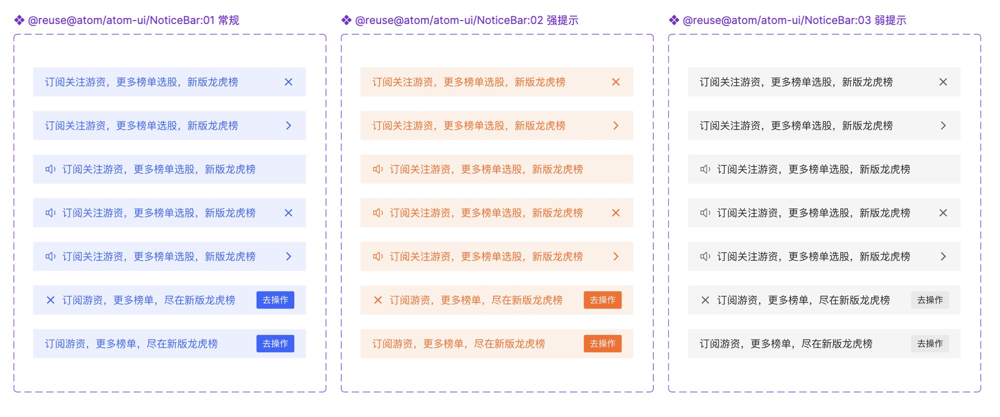

# NoticeBar（通知栏）

## Overview

通知栏用于显示系统消息、事件通知等内容。该组件位于**导航栏下方**，是一种不打断用户当前任务、又足够明显能持续引起关注的方式。

**设计师：** 陈亮

---

## 组件类型（Component Types）

根据通知栏的重要性决定视觉层级，分为三级：

| 类型 | Figma 名称 | 重要程度 | 使用场景 |
|---|---|---|---|
| 强提示 | `NoticeBar:02 强提示` | 醒目-重要、警示 | 强通知：政策变化、休市、预警；例如注册制实施导致的交易规则变化 |
| 常规 | `NoticeBar:01 常规` | 次要-易于察觉 | 常规业务消息通知、非必要规则变动；例如业务升级引导跳转 |
| 弱提示 | `NoticeBar:03 弱提示` | 弱-可以看到 | 长期存在、不记住关闭状态的消息，降低干扰 |

---

## 尺寸规范（Dimensions）

| 属性 | 值 | Token |
|---|---|---|
| 高度 | 40px | — |
| 左右内边距 | 16px | `padding-extra-loose` |
| 上下内边距（无操作按钮） | 11px¹ | — |
| 上下内边距（有操作按钮） | 8px | `padding-base` |
| 图标尺寸 | 16×16px | `sizing-square-base-small` |
| 宽度 | 页面级：全屏通栏；模块内：可配置 | — |

> ¹ 11px 无对应 padding token；取 `padding-base-loose`（10px）与 `padding-extra-loose`（16px）之间，直接使用原始值。

---

## 视觉规范（Visual Styles by Type）

### 02 强提示（橙色 / 重要警示）

| 属性 | 值 | Token |
|---|---|---|
| 背景色 | `rgba(255,102,26,0.1)` | `color-transparent-orange` |
| 文字颜色 | `#ff661a` | `color-orange` |
| 文字字号 | 14px | `font-size-medium` |
| 行高 | 18px | `line-height-medium` |

**变体（左图标 × 右侧内容）：**

| 变体 | 左侧 | 文字 | 右侧 |
|---|---|---|---|
| 喇叭-不可关闭 | 喇叭图标（B85） | 通知文本 | — |
| 喇叭-可关闭 | 喇叭图标（B85） | 通知文本 | × 关闭图标 |
| 重要-可关闭 | × 图标 | 通知文本 | × 关闭图标 |
| 有操作按钮 | 文字直接开始 | 通知文本 | 「去操作」按钮 |
| 有操作按钮（无喇叭） | — | 通知文本（无图标） | 「去操作」按钮 |

---

### 01 常规（蓝色 / 次要通知）

| 属性 | 值 | Token |
|---|---|---|
| 背景色 | `rgba(51,102,255,0.1)` | `color-transparent-blue` |
| 文字颜色 | `#3366ff` | `color-blue` |
| 文字字号 | 14px | `font-size-medium` |
| 行高 | 18px | `line-height-medium` |

**变体：**

| 变体 | 左侧 | 文字 | 右侧 |
|---|---|---|---|
| 跳转 | — | 通知文本 | → 箭头图标 |
| 可关闭 | — | 通知文本 | × 关闭图标 |
| 有操作按钮（关闭移左） | × 关闭图标 | 通知文本 | 「去操作」按钮 |
| 公告类型 | — | `公告：` + 通知文本 | → 箭头图标 |

> **特殊规则：** 右侧有操作按钮或跳转入口时，关闭（×）按钮**移至左侧**。
> **公告类型：** 文本前加前缀 `公告：` 标识。

---

### 03 弱提示（灰色 / 低干扰）

| 属性 | 值 | Token |
|---|---|---|
| 背景色 | `rgba(0,0,0,0.04)` | `color-background-weak` |
| 文字颜色 | `rgba(0,0,0,0.84)` | `color-text-primary` |
| 文字字号 | 14px | `font-size-medium` |
| 行高 | 18px | `line-height-medium` |

**变体：**

| 变体 | 左侧 | 文字 | 右侧 |
|---|---|---|---|
| 可关闭 | — | 通知文本 | × 关闭图标 |
| 跳转 | — | 通知文本 | → 箭头图标 |

---

## 内嵌操作按钮（Action Button）

| 属性 | 值 | Token |
|---|---|---|
| 背景色 | 与当前通知栏文字色一致（橙色 / 蓝色） | `color-orange` / `color-blue` |
| 高度 | 24px（上下 `padding-tight` 4px × 2 + `line-height-small` 16px） | — |
| 水平内边距 | 8px | `padding-base` |
| 最小宽度 | 40px | — |
| 圆角 | 2px | `radius-small` |
| 字号 | 12px | `font-size-extra-small` |
| 文字颜色 | 白色 | `color-text-inverse` |

---

## 跑马灯滚动（Marquee）

文本超出通知栏宽度时，启用跑马灯动画：

| 规则 | 说明 |
|---|---|
| 播放方式 | 文本从右向左滚动，播完一遍后空出一段距离再重复 |
| 两端间距 | 80px |

---

## 配置能力

| 场景 | 说明 |
|---|---|
| 页面级通知 | 建议使用**通栏**样式，横跨全屏宽度 |
| 模块内通知 | 可配置**非通栏**样式，限定在模块宽度内 |

---

## Constraints / Do & Don't

| | 规则 |
|---|---|
| ✅ | 根据信息重要程度选择强提示 / 常规 / 弱提示 |
| ✅ | 右侧有操作按钮时，将关闭按钮移至左侧 |
| ✅ | 公告类型在文本前加"公告："前缀 |
| ✅ | 页面级通知使用通栏；模块内通知可非通栏 |
| ✅ | 文本超长时使用跑马灯动画，前后段间距 80px |
| ❌ | 不要在弱提示上使用橙色/蓝色背景 |
| ❌ | 不要将关闭按钮和操作按钮同时放在右侧 |
| ❌ | 不要用强提示传达常规业务消息（层级混用） |

---

## Examples

