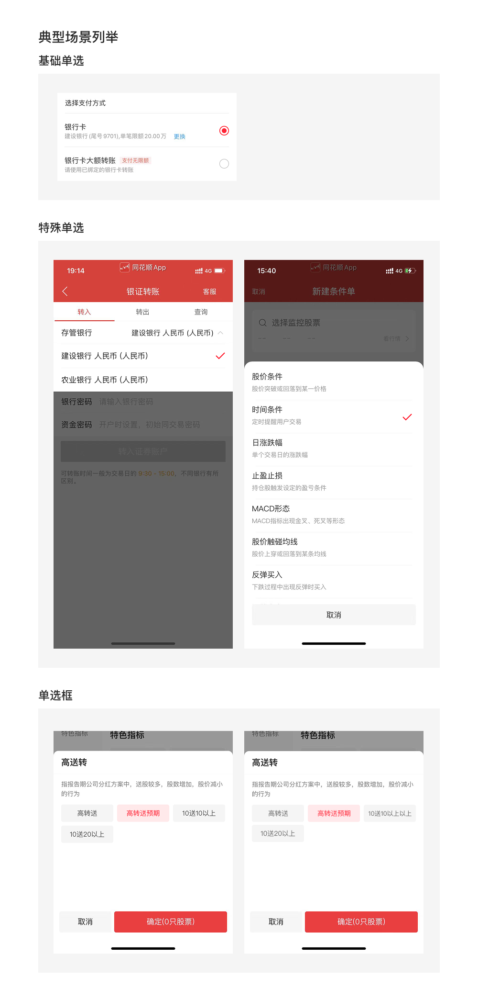

# 单选项（Radio）

## Overview

用于从多个选项中选择一项，且仅该选中项生效，常用于单选列表。

**设计师：** 武涵

---

## 组件类型（Component Types）

| 类型 | Figma 前缀 | 适用场景 |
|---|---|---|
| 基础单选 | `单选/01基础单选` | 列表行单选，从内容列表中选择一项 |
| 特殊单选列表 | `单选/02特殊单选` | 无需确认按钮、选中直接生效的场景，如下拉筛选 |
| 单选框 | `单选框` | 筛选页面的格子式单选按钮 |

---

## 基础单选

### 状态

| 状态 | Figma 名称 | 文字色 | Token |
|---|---|---|---|
| 已选中 | `01已选中` | `rgba(0,0,0,0.84)` | `color-text-primary` |
| 未选中 | `02未选中` | `rgba(0,0,0,0.84)` | `color-text-primary` |
| 不可选 | `03不可选` | `rgba(0,0,0,0.24)` | `color-text-quaternary` |
| 选中不可改 | `04选中不可改` | `rgba(0,0,0,0.84)` | `color-text-primary` |

### 尺寸规范

| 属性 | 值 | Token |
|---|---|---|
| 行高 | 50px | — |
| 单选框尺寸 | 20×20px | `sizing-square-medium` |
| 左右内边距 | 16px | `padding-extra-loose` |
| 分割线粗细 | 0.5px | `sizing-border-extra-small` |

### 文字规范

| 属性 | 值 | Token |
|---|---|---|
| 字号 | 16px | `font-size-base` |
| 行高 | 20px | `line-height-base` |
| 字重 | Regular (400) | `font-weight-regular` |

### 单选框位置规则

| 情景 | 单选框位置 |
|---|---|
| 列表行右侧无额外内容（纯文字行） | **右侧** |
| 列表行右侧有额外内容（如涨跌幅数据） | **左侧** |

> 单选框始终与所在行**垂直居中对齐**。

---

## 特殊单选列表

无需点击确认按钮、选中后直接更改结果的场景（例：下拉筛选列表）。

选中态不显示圆形单选框，改用 **✓ 勾选图标**（`单选/02特殊单选/01已选中`）置于行右侧。

### 尺寸规范

| 属性 | 值 | Token |
|---|---|---|
| 行高 | 60px | — |
| 图标尺寸 | 18×12px | — |
| 图标右边距 | 17px | — |
| 左侧文字左边距 | 16px | `padding-extra-loose` |
| 分割线颜色 | `#f6f6f6` | — ¹ |

> ¹ `#f6f6f6` 与 `color-background-weak`（`rgba(0,0,0,0.04)`）在白底上视觉相近，分割线直接使用原始值。

### 文字规范

| 属性 | 值 | Token |
|---|---|---|
| 字号 | 16px | `font-size-base` |
| 字重 | Regular (400) | `font-weight-regular` |
| 文字色 | `rgba(0,0,0,0.84)` | `color-text-primary` |

---

## 单选框（筛选场景）

格子式布局，在筛选页面按行排列多个选项，每行可为 2 / 3 / 4 列。与多选框（筛选场景）外观一致，区别在于同时只能选中一项。

### 高度变体

| 变体 | 高度 | 适用条件 |
|---|---|---|
| 紧凑（单行） | 36px | 筛选条件字数较少，无需折行 |
| 宽松（可折行） | 44px | 筛选条件字数较长，需折行；最多 12 字，最多 2 行 |

> 同一筛选页面内，所有单选框必须统一使用相同高度变体，不可混用。

### 内边距规范

| 变体 | 上下内边距 | Token |
|---|---|---|
| 36px | 9px | — ² |
| 44px | 4px | `padding-tight` |

> ² 9px 无对应 token；介于 `padding-base`（8px）与 `padding-base-loose`（10px）之间，直接使用原始值。

### 文字规范

| 属性 | 值 | Token |
|---|---|---|
| 字号 | 14px | `font-size-medium` |
| 行高 | 18px | `line-height-medium` |
| 字重 | Regular (400) | `font-weight-regular` |
| 对齐 | 水平居中 | — |

### 视觉规范（状态）

| 状态 | 背景色 | 值 | Token | 文字色 | 值 | Token |
|---|---|---|---|---|---|---|
| 已选中 | 蓝色半透明 | `rgba(46,88,255,0.10)` | `color-transparent-red` | 品牌主色 | `#2E58FF` | `color-brand-primary` |
| 未选中 | 弱背景 | `rgba(0,0,0,0.04)` | `color-background-weak` | 二级文字 | `rgba(0,0,0,0.60)` | `color-text-secondary` |

> 已选中的格子在角落显示一个选中角标（checkmark badge）。

### 其他属性

| 属性 | 值 | Token |
|---|---|---|
| 圆角 | 4px | `radius-medium` |
| 格子间距（gap） | 8px | `margin-base` |
| 页面左右边距 | 16px | `padding-extra-loose` |

### 列数与格宽（375px 基准）

| 列数 | 每格宽度 |
|---|---|
| 2 列 | ~168px |
| 3 列 | ~109px |
| 4 列 | ~80px |

> 宽度公式：`(375 - 16×2 - 8×(N-1)) / N`，随屏幕宽度自适应。

---

## Constraints / Do & Don't

| | 规则 |
|---|---|
| ✅ | 列表行右侧有额外内容时，单选框置于左侧 |
| ✅ | 单选框与所在行垂直居中对齐 |
| ✅ | 特殊单选列表中，选中态使用勾选图标，不显示圆形单选框 |
| ✅ | 同一筛选页面统一使用 36px 或 44px 变体，不要混用 |
| ✅ | 筛选条件超过 12 字时改用 44px 变体（允许折行） |
| ✅ | 单选框（筛选）同一时刻只能有一项处于选中态 |
| ❌ | 不要在 36px 变体中放长文字（会被截断） |
| ❌ | 不要在同一列表中，部分行单选框在左、部分在右 |
| ❌ | 不要超过 2 行文字（单选框格子不支持 3 行及以上） |
| ❌ | 不要将特殊单选列表用于需要确认操作的场景 |

---

## Examples

