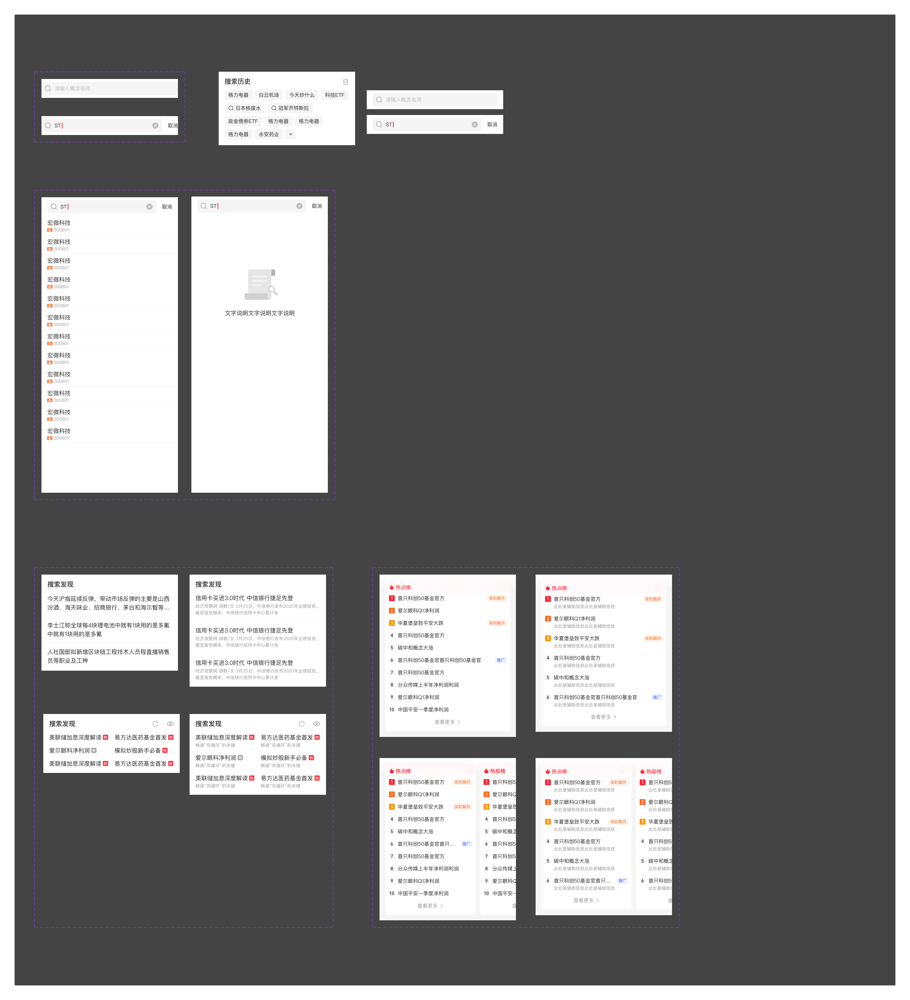

# 搜索（Search）

## Overview

搜索组件提供统一的搜索入口与搜索前置页规范，涵盖**搜索入口**、**点击后展开方式**、**搜索前置内容模块**及**搜索中状态**四个层次。

**设计师：** 待补充  
**设计来源帧：** `搜索`

---

## 组件构成

```
搜索（Search）
├── 搜索入口
│   ├── 入口1：搜索框     页面内独立搜索框
│   └── 入口2：导航栏图标  搜索图标内嵌于 Navbar 右侧图标位
├── 点击后展开方式
│   ├── 在页面搜索        保留当前页或跳转新页，搜索框激活
│   └── 在弹窗搜索        当前页展示弹窗，搜索框激活
├── 搜索前置页（Pre-search Landing）
│   ├── 模块1：搜索历史（浏览记录）
│   ├── 模块2：搜索发现
│   └── 模块3：热榜
└── 搜索中（Searching）
    ├── 搜索中_列表      有匹配内容，展示模糊匹配结果
    └── 搜索中_空状态    无匹配内容，展示空状态
```

---

## 一、搜索入口

### 1.1 入口1：搜索框

搜索框作为独立组件展示在页面内（通常位于导航栏正下方）。

| 属性 | 值 | Token |
|---|---|---|
| 搜索框左边距 | 16px | `padding-extra-loose` |
| 搜索框高度 | 35px（以具体需求为准） | — |
| 搜索框背景 | `#F5F5F5` | `color-background-layer1` |
| 搜索框圆角 | 4px | `radius-medium` |
| 左侧搜索图标 | `1图标/线性/10A6搜索`，20×20px，opacity 24% | `sizing-square-medium`，`color-text-quaternary` |
| 图标左内边距 | 10px | `padding-base-loose` |
| 图标与输入区分隔线 | 1px 垂直线，高度 18px | — |
| 占位文字 | `rgba(0,0,0,0.24)`，14px Regular | `color-text-quaternary`，`font-size-medium`，`font-weight-regular` |
| 清除按钮（有内容时） | `1图标/填充/C11 错-圆圈-填充`，18×18px，默认隐藏 | — |

> 搜索框尺寸（宽度/高度）及内部图标、占位文案以具体需求为准，此处仅为结构参考。

**取消按钮：**

| 属性 | 值 | Token |
|---|---|---|
| 文字 | 取消 | — |
| 字号 / 字重 | 14px Regular | `font-size-medium`，`font-weight-regular` |
| 颜色 | `rgba(0,0,0,0.84)` | `color-text-primary` |
| 位置 | 搜索框右侧，垂直居中对齐 | — |

**滚动交互（可选）：**

| 行为 | 说明 |
|---|---|
| 上滑页面 | 搜索框隐藏 |
| 下滑页面 | 搜索框重新出现 |
| 上滑 + 导航栏图标联动（可选） | 上滑时搜索框隐藏，导航栏出现搜索图标；下滑时搜索框出现，导航栏图标消失 |

### 1.2 入口2：导航栏图标

搜索图标（`1图标/线性/10A6搜索`，`sizing-square-medium` 24px）内嵌于 [Navbar](./navbar.md) 右侧图标位，复用 Navbar 图标规范。

---

## 二、点击后展开方式

点击任意搜索入口后，必须：
- 搜索框内唤起光标（激活态）
- 底部弹起键盘

### 2.1 在页面搜索

点击后可选择以下任一方式：

| 方式 | 说明 |
|---|---|
| 保留当前页 | 当前页面标题不变，搜索框在原位激活，右侧出现「取消」按钮 |
| 跳转新页 | 导航至独立搜索页，搜索框激活，右侧出现「取消」按钮 |

### 2.2 在弹窗搜索

点击后在当前页面叠加弹窗，弹窗顶部展示激活态搜索框 + 「取消」按钮，底部弹起键盘。

---

## 三、搜索前置页内容模块

进入搜索（页面或弹窗）后、用户开始输入前，展示以下内容模块，均可按需选配。

### 3.1 模块1：搜索历史

展示用户历史搜索记录，以标签 chip 形式排列。

**模块头部：**

| 属性 | 值 | Token |
|---|---|---|
| 标题文字（如"搜索历史"） | 14px Medium | `font-size-medium`，`font-weight-medium` |
| 右上角图标 | 20×20px，可自定义 | `sizing-square-medium` |

> 模块标题文案、右上角图标展示与否及点击反馈均以具体需求为准。

**历史标签 Chip：**

| 属性 | 值 | Token |
|---|---|---|
| 高度 | 28px | — |
| 内左边距 | 10px | `padding-base-loose` |
| 内上边距 | 4px | `padding-tight` |
| 文字高度 | 20px（14px 字号，`line-height-base`） | `font-size-medium`，`line-height-base` |
| 小搜索图标（可选，在 chip 内） | 16×16px | `sizing-square-base-small` |
| 展开/收起图标 | 12×12px | `sizing-square-extra-small` |

> 最多展示行数可自定义；超出后折叠，通过展开/收起图标控制。

### 3.2 模块2：搜索发现

展示推荐关键词，以文本列表形式排列，支持 1 列或 2 列布局。

**模块头部：**

| 属性 | 值 | Token |
|---|---|---|
| 标题文字（如"搜索发现"） | 14px Medium | `font-size-medium`，`font-weight-medium` |
| 右上角图标区 | 可含 1–2 个图标 + 竖向分隔线（1×16px） | `sizing-square-medium` |

> 模块标题、右上角图标展示与否及内容均可自定义。

**内容区布局：**

| 布局 | 说明 | 左列 x | 右列 x | 行高 | 行间距 |
|---|---|---|---|---|---|
| 一列 | 全宽展示，支持 2 行换行 | 16px | — | 20px（单行）/ 44px（两行） | — |
| 两列 | 左右两列并排 | 16px | 197px | 20px | 36px |

> 列数与行数均可自定义；内容超出最大宽度时末尾截断。

**辅助信息（可选副文字行）：**

| 属性 | 值 | Token |
|---|---|---|
| 辅助文字字号 | 12px Regular | `font-size-extra-small`，`font-weight-regular` |
| 辅助文字颜色 | `rgba(0,0,0,0.60)` | `color-text-secondary` |
| 主文字与辅助文字间距 | 22px（主文字底部到辅助文字顶部） | — |

### 3.3 模块3：热榜

展示热点榜单，以卡片形式横向滚动，支持四种布局变体。

**模块头部：**

| 属性 | 值 | Token |
|---|---|---|
| 标题文字（如"热榜"） | 14px Medium，位于卡片内左上 | `font-size-medium`，`font-weight-medium` |

> 标题可自定义，可在标题前添加图标。

**热榜卡片通用规范：**

| 属性 | 值 | Token |
|---|---|---|
| 卡片内左右边距 | 16px | `padding-extra-loose` |
| 排名徽标尺寸 | 16×16px | `sizing-square-base-small` |
| 排名徽标左边距（卡片内容区） | 10px | `padding-base-loose` |
| 主内容文字左边距（徽标后） | 排名徽标左(10px) + 宽(16px) + 间距(8px) = 34px | — |
| 主内容行高 | 20px（14px 字号） | `font-size-medium`，`line-height-base` |
| 辅助信息行高 | 约 17px（12px 字号） | `font-size-extra-small` |
| 行垂直间距（主内容行之间） | 34px | — |
| 辅助信息与主内容间距 | 22px | — |
| 右侧标签徽标（可选） | 28×16px，内左边距 4px | `padding-tight` |
| 右侧标签文字 | 10px | `font-size-xxs` |
| 「查看更多」链接（可选） | 文字 + `1图标/线性/2A-022 箭头-右16`（16×16px），水平居中置底 | `sizing-square-base-small` |

**四种布局变体：**

| 变体 | 卡片宽度 | 卡片间距 | 辅助信息 |
|---|---|---|---|
| 一列半 / 无辅助信息 | 245px（一屏显示约 1.5 张） | 12px | 无 |
| 一列半 / 有辅助信息 | 245px | 12px | 有 |
| 一列 / 无辅助信息 | 375px（全屏，内容区 343px） | — | 无 |
| 一列 / 有辅助信息 | 375px（全屏，内容区 343px） | — | 有 |

> 「查看更多」是否展示以具体需求为准；点击反馈可自定义。

---

## 四、搜索中（Searching）

用户在搜索框输入内容后，根据已输入内容进行模糊匹配，实时展示候选列表或空状态。

### 4.1 搜索中_列表

| 属性 | 值 | Token |
|---|---|---|
| 列表左右边距 | 16px | `padding-extra-loose` |
| 行间分隔线 | 水平线，颜色 `rgba(0,0,0,0.08)` | `color-divider` |

**列表行（每条候选结果）：**

| 元素 | 字号 / 字重 | 颜色 | Token |
|---|---|---|---|
| 主文字（结果名称） | 16px Regular | `rgba(0,0,0,0.84)` | `font-size-base`，`font-weight-regular`，`color-text-primary` |
| 主文字中**与输入重叠**的部分 | 同上，高亮色 | `#2E58FF` | `color-brand-primary` |
| 副文字（如股票代码） | 12px Regular | `rgba(0,0,0,0.40)` | `font-size-extra-small`，`font-weight-regular`，`color-text-tertiary` |

> 列表单条内容结构以具体业务需求定义；与已输入内容重叠的匹配部分必须高亮显示。

**可选标签徽标（Tag Badge）：**

复用 [Tag 标签](./tag.md) 组件中的「01重要标签_实底_高10」变体（如蓝色标签）。

| 属性 | 值 | Token |
|---|---|---|
| 背景色（蓝） | `#3366FF` | `color-blue` |
| 文字 | 9px Medium，白色 | `font-size-xxxs`，`font-weight-medium`，`color-text-inverse` |
| 圆角 | 1px | `radius-extra-small` |

### 4.2 搜索中_空状态

无匹配内容时展示空状态，替代候选列表区域。

| 属性 | 值 | Token |
|---|---|---|
| 空状态插图 | `缺省图/01主图/01搜索为空`，水平居中 | — |
| 提示文字 | 14px Regular，水平居中 | `font-size-medium`，`font-weight-regular`，`color-text-primary` |
| 提示文案 | 可自定义，默认"没有找到相关内容" | — |

---

## Icon 索引

| 用途 | Figma 组件名 | SVG 文件 |
|---|---|---|
| 搜索框/入口图标（线性） | `1图标/线性/10A6搜索` | `assets/icons/actions/search.svg` |
| 搜索框清除按钮（填充） | `1图标/填充/C11 错-圆圈-填充` | `assets/icons/actions/clear-circle.svg` |
| Chip 内小搜索图标 | `icon_search_s` | — |
| 历史列表展开/收起 | `icon_list_open2` | — |
| 模块头部操作图标 | `A94` / `A94备份` | — |
| 热榜「查看更多」箭头 | `1图标/线性/2A-022 箭头-右16` | `assets/icons/arrows/arrow-right-16.svg` |
| 搜索空状态插图 | `缺省图/01主图/01搜索为空` | — |

---

## 交互行为总览

| 触发 | 行为 |
|---|---|
| 点击搜索框（入口1） | 跳转页面或展示弹窗；搜索框激活，唤起光标，底部弹起键盘 |
| 点击导航栏搜索图标（入口2） | 同上 |
| 上滑页面（搜索框入口） | 搜索框随页面隐藏 |
| 下滑页面（搜索框入口） | 搜索框重新出现 |
| 输入内容 | 清除图标（circle-X）出现 |
| 点击清除图标 | 清空输入内容，图标隐藏，返回搜索前置页 |
| 点击「取消」 | 关闭搜索，返回原始状态 |
| 输入内容 → 有匹配 | 展示模糊匹配候选列表，匹配部分红色高亮 |
| 输入内容 → 无匹配 | 展示空状态插图 + 提示文字 |

---

## Constraints / Do & Don't

| | 规则 |
|---|---|
| ✅ | 点击任意搜索入口后，必须唤起光标并弹起键盘 |
| ✅ | 搜索框清除按钮（circle-X）默认隐藏，仅在有输入内容时显示 |
| ✅ | 搜索框大小、图标、占位文案以具体业务需求为准 |
| ✅ | 热榜卡片排名徽标颜色可按业务需求区分（如前三名与其余名次） |
| ✅ | 搜索发现模块列数（1列/2列）、行数均可按需自定义 |
| ✅ | 搜索历史标签超出最大行数后须折叠，不可无限展开 |
| ❌ | 不要省略「取消」按钮（搜索激活态必须提供退出方式） |
| ❌ | 不要在两列布局中使用固定右列 x=197px 以外的对齐（须保证两列间距一致） |
| ❌ | 不要对热榜行间距（34px）做任意调整，保持所有条目视觉对齐 |
| ✅ | 搜索中列表必须将与输入内容重叠的匹配部分高亮为 `color-brand-primary`（`#2E58FF`） |
| ❌ | 不要在无匹配时展示空列表，须替换为空状态插图 + 提示文字 |

---

## Examples


