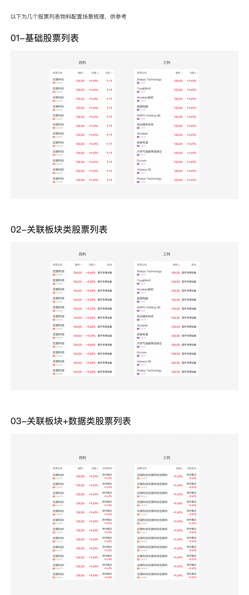

# 股票列表行（Stock List Row）

## Overview

股票列表行是行情类页面的核心列表单元。支持**通栏**和**卡片**两种布局，**可滑动**与**不可滑动**两种交互模式，**三列**与**四列**两种数据列配置，以及 **Light / Dark** 双主题。

**设计师：** 王珞燊  
**设计来源帧：** `08股票列表——视觉规范`

---

## 命名规范（Naming Convention）

```
单条股票列表 / [布局] / [交互] / [列数] / [市场] / [主题]
```

| 维度 | 取值 |
|---|---|
| 布局 | `01通栏` / `02卡片` |
| 交互 | `01可滑动` / `02不可滑动` |
| 列数 | `01常规四列` / `02常规三列` |
| 市场 | （空，A股/港股）/ `美股两行` |
| 主题 | `Light` / `Dark` |

示例：`单条股票列表/01通栏/01可滑动/01常规四列/Light`

---

## 尺寸规范（Dimensions）

| 属性 | 值 | Token |
|---|---|---|
| 行高 | **52px** | — |
| 左右外边距（通栏） | **16px** | `margin-loose` |
| 内容区总宽（375px 基准） | **343px**（375 − 16 × 2） | — |
| 分割线粗细 | **0.5px** | `sizing-border-extra-small` |
| 分割线颜色 Light | `rgba(0,0,0,0.08)` | `color-divider` |
| 分割线颜色 Dark | `rgba(255,255,255,0.08)` | `color-divider` |
| 分割线范围 | 左边距起，至右边缘 flush（左 inset 16px，右 inset 0） | — |

---

## 列布局（Column Layout）

### 四列（4 Columns）— 375px 基准，精确像素值

| 列 | 起始 x | 宽度 | 结束 x | 对齐 |
|---|---|---|---|---|
| 名称区 | 16px | 103px | 119px | 左对齐 |
| 列表1（数据列 1） | 127px | 72px | 199px | 右对齐 |
| 列表2（数据列 2） | 207px | 72px | 279px | 右对齐 |
| 列表3（数据列 3） | 287px | 72px | 359px | 右对齐 |

> 列间间距：8px（`margin-base`）。

### 三列（3 Columns）— 375px 基准

| 列 | 说明 | 对齐 |
|---|---|---|
| 名称区 | 宽于四列版（约 183px） | 左对齐 |
| 数据列 1 | 约 72px | 右对齐 |
| 数据列 2 | 约 72px | 右对齐 |

---

## 对齐规则（Alignment Rules）

| 元素 | 对齐方式 |
|---|---|
| 股票名称、股票代码、市场标签 | **左对齐** |
| 所有数据列（列表1 / 2 / 3）的数值 | **右对齐** |

> 规范原文：「股票名称类、及第一列数据全部左对齐；数据列表区全部右对齐。」  
> 注：此处「第一列」指名称列（名称区），不是列表1。

---

## 行内垂直布局

行高 52px，内容分两条水平线：

| 线 | y 坐标 | 高度 | 用途 |
|---|---|---|---|
| 主行 | y = 8px | 20px | 股票名称 + 主数据（价格、涨跌幅） |
| 副行 | y = 30px | 16px | 股票代码 + 副数据（前收盘等） |
| 市场标签 | y = 33px | 10px | 融 / HK / US 等标签 |

**美股两行（美股两行）**：整体 52px 不变，主行价格（y=8）展示实时价+涨跌幅，副行（y=30）展示前收盘等参考数据，字号缩小为 12px（`font-size-extra-small`）。

---

## 文字规范（Typography）

### 字体

| 类型 | 字体 | Token | 适用内容 |
|---|---|---|---|
| 金融数字体 | THS Money font | `font-family-number` | 涨跌数据、价格等主数据 |
| 常规体 | PingFang SC Regular | `font-family-ios-cn` | 股票名称、代码等文字内容 |

> 当数据含「万」「亿」等单位时，单位字与数字保持一致，使用 `font-family-number`。

### 字号

| 元素 | 字号 | Token | 字重 | Token |
|---|---|---|---|---|
| 股票名称（主行） | 16px | `font-size-base` | Regular | `font-weight-regular` |
| 主数据（价格、涨跌幅） | 16px | `font-size-base` | Medium | `font-weight-medium` |
| 股票代码（副行） | 12px | `font-size-extra-small` | Regular | `font-weight-regular` |
| 副数据（前收盘等） | 12px | `font-size-extra-small` | Medium | `font-weight-medium` |
| 最小字号（动态缩放下限） | **10px** | `font-size-xxs` | — | — |

> 规范：列表内字号在容器内动态适配缩小；适配到 10px 仍展示不下时，截断显示「…」。

### 颜色

| 元素 | Light 模式 | Dark 模式 | Token |
|---|---|---|---|
| 股票名称 | `rgba(0,0,0,0.84)` | `rgba(255,255,255,0.84)` | `color-text-primary` |
| 股票代码 / 副数据 | `rgba(0,0,0,0.40)` | `rgba(255,255,255,0.40)` | `color-text-tertiary` |
| 涨（上涨） | `#FF2436` | `#FF2436` | `color-price-up` |
| 跌（下跌） | `#07AB4B` | `#07AB4B` | `color-price-down` |

---

## 市场标签（Market Labels）

标签位于股票代码行左侧（y=33，高度 10px）。详细规格见 [tag.md — Stock 特殊变体](./tag.md)。

### 标签类型速查

| 标签 | 显示文字 | 背景色 Token | 宽度 |
|---|---|---|---|
| A股融资融券 | `融` | `color-orange` | 14px |
| 创业板 | `创` | `color-yellow` | 14px |
| 港股通 | `HK` | `color-blue` | 20px |
| 英股 | `UK` | `color-red-grey` | 自适应 |
| 美股 | `US` | `color-purple` | 14px |
| 基金 | `基金` | `color-orange` | 自适应 |
| 期货 | `期货` | `color-acidblue` | 自适应 |

> 标签左边距 = 16px（`margin-loose`，与名称区左边距对齐）；股票代码起始 x = 标签右边 + 4px gap（`margin-tight`）≈ 34px。  
> A股主板股票不展示任何标签（默认市场）。

---

## 主题（Themes）

| 主题 | 行背景色 | Token |
|---|---|---|
| Light | `#FFFFFF` | `color-foreground-layer1` |
| Dark | `#1C1C1C` | `color-foreground-layer1` |

---

## 交互模式（Interaction）

### 可滑动（Swipeable `01可滑动`）

- 用户从右向左滑动，从行右侧划出操作按钮区域
- **表头右侧须添加小箭头**作为可滑动指示器（`表头/可滑动/指示箭头/Light`）
- 操作按钮高度 28px（`按钮/01主要按钮/07文本+图标_高28`）

### 不可滑动（Non-swipeable `02不可滑动`）

- 行不响应左滑，无操作按钮
- **卡片布局默认采用此模式**

---

## 表头规范（Header）

**组件前缀：** `表头/[布局]/[交互]/[列数]`  
**固定高度：** 40px

### 列头内容（四列示例）

| 列 | 默认文字 | x 坐标 | 对齐 |
|---|---|---|---|
| 名称区 | — | — | — |
| 列表1 | 最新 | 171 | 右 |
| 列表2 | 涨幅 | 251 | 右 |
| 列表3 | 涨跌 | 331 | 右 |

> 容器展示宽度以表头**容器**为准，非以表头文字宽度为准；若表头内容超出，截断显示「…」。

### 排序箭头

- 组件名：`表头排序上下箭头/未选择`、`表头排序上下箭头/选择/正序`
- 尺寸：7×12px，位于列头文字右侧
- 规范：可排序表头默认全部展示 ↕️（未选择态），点击后切换为 ↑ 或 ↓

### 表头变体

| 变体 | 说明 |
|---|---|
| `表头（常规）` | 标准列头，只有文字和排序箭头 |
| `表头有时间` | 列头带时间戳（如"2022/02/23"）|
| `表头两行` | 列头展示两行文字（带时间时↕️保持垂直居中）|
| `表头添加按钮` | 列头右侧有添加操作按钮（通常位于表头右侧最末位）|
| `表头内容过长` | 列头内容超出宽度时的截断展示规则 |

---

## 特殊展示规则

### 纯中文数据

- 数据列内若有纯中文内容（如行业名、说明文字），允许折行（最多两行）
- 默认不折行，需业务明确指定时才开启

### 长股票名称

- 名称区宽度有限（四列时 103px），过长时动态缩小字号至 10px（`font-size-xxs`），之后截断显示「…」
- 示例：`宏微科技宏微科技宏…`、`中国国际金融香...`

---

## Constraints / Do & Don't

| | 规则 |
|---|---|
| ✅ | 价格与涨跌幅使用 `font-family-number`（THS Money font），股票名称/代码使用 `font-family-ios-cn`（PingFang SC） |
| ✅ | 名称区及所有标签左对齐；数据列内容全部右对齐 |
| ✅ | 行高固定 52px，不因内容多少撑高 |
| ✅ | 可滑动模式在表头右侧添加指示箭头 |
| ✅ | 表头高度 40px，数据行高度 52px，不可混用 |
| ✅ | 列宽排序：名称区 103px > 数据列 72px（四列基准 375px） |
| ✅ | 含「万」「亿」单位文字时，单位与数字同用 `font-family-number` |
| ❌ | 不要在数据列里左对齐数值 |
| ❌ | 不要让行高随内容自动撑开 |
| ❌ | 不要在可滑动列表头上省略滑动指示箭头 |
| ❌ | 不要将字号设低于 10px（`font-size-xxs`） |

---

## Examples


