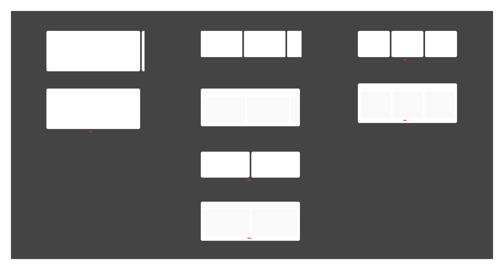

# 泳道卡片（Swimlane Card）

## Overview

在同一页面的 X 轴上扩展内容的卡片，可在占据较少屏幕空间的情况下扩展较多内容。

**设计师：** 毛帅  
**设计来源帧：** `泳道卡片`

---

## 组件构成

```
泳道卡片（Swimlane Card）
├── 焦点卡片（Focus Card）
│   ├── 前后卡片连续     当前卡片居中，其他卡片仅露出边缘
│   └── 前后卡片独立     整屏滑动，停下时卡片处于屏幕正中
├── 连续侧滑卡片（Continuous Swipe Card）
│   ├── 截断样式         卡片右侧截断，无需滑动指示器
│   └── 非截断样式       卡片完整显示，需使用滑动指示器
├── 成组卡片（Grouped Card）
│   └── 整屏成组滑动，使用分页滑动指示器
└── 容器（Container）    嵌套连续侧滑卡片或成组卡片
    ├── 连续侧滑卡片_截断_容器内
    ├── 连续侧滑卡片_非截断_容器内
    └── 独立侧滑卡片_容器内
```

---

## 一、焦点卡片（Focus Card）

卡片信息在页面中起**主导作用**，需要特别引起用户关注。

### 1.1 前后卡片连续

当前卡片居中，占据屏幕宽度的主要部分，其他卡片仅露出边缘。

| 属性 | 值 | Token |
|---|---|---|
| 卡片左右内边距 | 16px | `padding-extra-loose` |
| 卡片间距（gap） | 6px | `margin-base-tight` |
| 卡片内部垂直间距 | 6px | `padding-base-tight` |
| 滑动行为 | 连续滑动，跟随手势惯性，停止时位置不固定 | — |

### 1.2 前后卡片独立

整屏滑动，卡片停下时总是处于屏幕正中。可使用分页滑动指示器。

| 属性 | 值 | Token |
|---|---|---|
| 滑动行为 | 整屏滑动，停止时卡片始终对齐屏幕中心 | — |
| 是否使用指示器 | 可选，使用分页滑动指示器 | — |

---

## 二、连续侧滑卡片（Continuous Swipe Card）

卡片信息在页面中**非主导作用**，卡片数量不固定。通常选用截断样式，连续滑动的示意更明确。

> 某些特殊情况可选用非截断式，如上下楼层卡片样式较多，希望减少排列杂乱感。

### 2.1 截断样式

| 属性 | 值 | Token |
|---|---|---|
| 最后一张卡片 | 右侧截断，暗示仍有更多内容 | — |
| 滑动行为 | 连续滑动，跟随手势惯性，停止时位置不固定 | — |
| 滑动指示器 | **无需使用** | — |
| 卡片间距（gap） | 6px | `margin-base-tight` |
| 卡片内边距（左右） | 6px | `padding-base-tight` |

### 2.2 非截断样式

| 属性 | 值 | Token |
|---|---|---|
| 卡片展示 | 卡片完整显示，不截断 | — |
| 滑动行为 | 连续滑动，跟随手势惯性，停止时位置不固定 | — |
| 滑动指示器 | **应使用** 滑动指示器 | — |

---

## 三、成组卡片（Grouped Card）

卡片信息在页面中**非主导作用**，卡片数量**相对固定**。

| 属性 | 值 | Token |
|---|---|---|
| 排列方式 | 卡片成组排列，总数量 = 一屏卡片数量 × N 组 | — |
| 数量约束 | 最后一组的卡片数量必须能凑满一屏，不可出现不满屏的情况 | — |
| 滑动行为 | 整屏成组滑动，使用分页滑动指示器 | — |
| 卡片间距 | 6px | `margin-base-tight` |
| 卡片上内边距 | 6px | `padding-base-tight` |

---

## 四、容器（Container）

「成组卡片」及「连续侧滑卡片」可以嵌套于一个大容器卡片中。

| 子类型 | 滑动行为 | 指示器类型 |
|---|---|---|
| 连续侧滑卡片_截断_容器内 | 连续滑动，跟随手势惯性，停止时位置不固定 | 无 |
| 连续侧滑卡片_非截断_容器内 | 整屏成组滑动，停止后页面随惯性继续滑动 | 连续滑动指示器 |
| 独立侧滑卡片_容器内 | 整屏成组滑动，停止后页面固定停在某一分页 | 分页滑动指示器 |

### 容器间距规范

| 属性 | 值 | Token |
|---|---|---|
| 容器左右内边距 | 10px | `padding-base-loose` |
| 容器内卡片间距（gap） | 8px | `margin-base` |

---

## 滑动指示器

复用 [PageIndicator 页面指示器](./page-indicator.md)，根据滑动行为选型：

| 场景 | 使用类型 | 说明 |
|---|---|---|
| 整屏翻页（吸附） | 翻页指示器（01） | 焦点卡片独立、成组卡片、容器内独立侧滑 |
| 连续滑动（不吸附） | 自由滑动指示器（02） | 连续侧滑卡片非截断、容器内连续侧滑非截断 |

> 具体尺寸、颜色、圆角规格见 [page-indicator.md](./page-indicator.md)，此处不重复定义。

---

## 选型决策树

```
卡片信息是否起主导作用？
├── 是 → 焦点卡片
│   └── 需要卡片停在正中央？
│       ├── 是 → 前后卡片独立（整屏滑动）
│       └── 否 → 前后卡片连续（露出边缘）
└── 否 → 卡片数量是否固定？
    ├── 是 → 成组卡片（整屏成组滑动，数量必须是一屏的整倍数）
    └── 否 → 连续侧滑卡片
        └── 是否需要视觉上更整齐？
            ├── 否 → 截断样式（无指示器）
            └── 是 → 非截断样式（需指示器）
```

---

## Constraints / Do & Don't

| | 规则 |
|---|---|
| ✅ | 成组卡片的总数量必须是「一屏卡片数量」的整数倍，最后一组不可出现不满屏的情况 |
| ✅ | 连续侧滑卡片的截断样式不使用滑动指示器；非截断样式必须使用滑动指示器 |
| ✅ | 焦点卡片（前后独立）和成组卡片需使用分页滑动指示器 |
| ✅ | 容器内的连续侧滑（非截断）使用「连续滑动指示器」；容器内独立侧滑使用「分页滑动指示器」 |
| ✅ | 「成组卡片」和「连续侧滑卡片」可嵌套在容器中；「焦点卡片」不可嵌套 |
| ✅ | 指示器样式与规格统一使用 [PageIndicator](./page-indicator.md) 组件，不可自行定义尺寸或颜色 |
| ❌ | 不要在成组卡片中出现最后一组卡片数量少于一屏容量的情况 |
| ❌ | 截断样式不可使用滑动指示器（视觉截断本身已暗示可滑动） |
| ❌ | 不要将焦点卡片嵌套于容器中使用 |

---

## Examples


