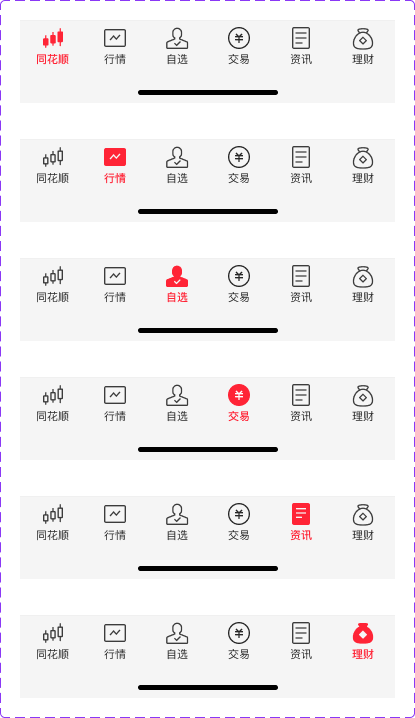

# Tab Bar (底部导航栏)

## Overview

The tab bar sits at the bottom of the screen. It contains 6 fixed tabs. Tab icons are **custom SVGs baked into the component** — they do not use the general `assets/icons/` library.

**Icon location:** `assets/icons/tabbar/`

---

## Tabs

| Tab | 中文 | Selected SVG | Unselected SVG |
|---|---|---|---|
| 首页 (Home) | 同花顺 | `tabbar/home-selected.svg` | `tabbar/home-outline.svg` |
| 行情 (Market) | 行情 | `tabbar/market-selected.svg` | `tabbar/market-outline.svg` |
| 自选 (Watchlist) | 自选 | `tabbar/watchlist-selected.svg` | `tabbar/watchlist-outline.svg` |
| 交易 (Trading) | 交易 | `tabbar/trading-selected.svg` | `tabbar/trading-outline.svg` |
| 资讯 (News) | 资讯 | `tabbar/news-selected.svg` | `tabbar/news-outline.svg` |
| 理财 (Wealth) | 理财 | `tabbar/wealth-selected.svg` | `tabbar/wealth-outline.svg` |

**Tab order (left → right):** 首页 · 行情 · 自选 · 交易 · 资讯 · 理财

---

## Icon States

| State | Fill color | Usage |
|---|---|---|
| Selected (`-selected.svg`) | `#2E58FF` (brand blue) | The currently active tab |
| Unselected (`-outline.svg`) | `black` `fill-opacity: 0.84` + `opacity: 0.9` | All inactive tabs |

The selected and unselected paths differ slightly — the selected version is a simplified/filled shape; the unselected is more detailed with an explicit stroke/outline structure.

---

## Special: 交易 (Trading) Icon

The trading icon is unique — it uses a **filled red circle** as background with a **white ¥ symbol** inside when selected:

```
Selected:  blue circle (#2E58FF) + white ¥ path inside
Unselected: circle outline (black 0.84) + black ¥ path inside
```

---

## Figma Component Structure

The Tabbar is a COMPONENT_SET (`19:10867`) with 6 module variants:

| Figma Variant | Active Tab |
|---|---|
| `模块=首页` | 首页 |
| `模块=行情` | 行情 |
| `模块=自选` | 自选 |
| `模块=交易` | 交易 |
| `模块=资讯` | 资讯 |
| `模块=理财` | 理财 |

Each module variant is a full-width frame containing all 6 tab slots. Use the variant where the correct tab is active.

---

## Constraints / Do & Don't

| | Rule |
|---|---|
| ✅ | Use `-selected.svg` for the active tab, `-outline.svg` for all others |
| ✅ | Always show all 6 tabs — the tab bar is fixed and not configurable |
| ✅ | Tab order is fixed: 首页 · 行情 · 自选 · 交易 · 资讯 · 理财 |
| ❌ | Do not apply `currentColor` to these SVGs — colors are hardcoded by design intent |
| ❌ | Do not mix tab bar icons with the general icon library (`assets/icons/actions/`, etc.) |

---

## Examples



