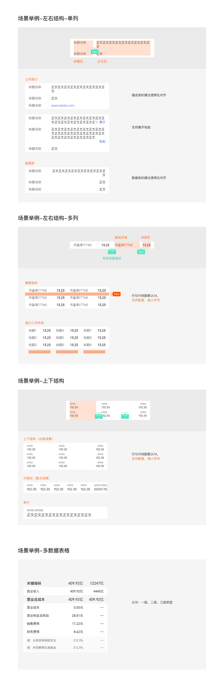

# 表格（Table）

## Overview

表格是由若干"行"与"列"构成的有序信息展示组件，优势是可以一次性展示多条数据。常用于财务报表、关键指标、多维数据对比等场景。

**设计师：** 武涵

---

## 组件类型（Component Types）

根据布局结构分为两种：

| 类型 | 布局 | 适用场景 |
|---|---|---|
| 左右结构（横向） | 表头固定在左侧，数据列向右展开 | 数据列较多，需支持多列横向滑动 |
| 上下结构（纵向） | 表头在上方，数据逐行向下排列 | 数据内容较为固定，可支持左右滑动及多行展示 |

---

## 列类型（Column Row Types）

表格栏分为三个层级：

### 一级表格栏（分类表头行）

用于标示分组类别（如"关键指标"、"营业总收入"）。

| 属性 | 值 | Token |
|---|---|---|
| 背景色 | `rgba(0,0,0,0.04)` | `color-background-weak` |
| 行高 | 36px | — |
| 左内边距 | 16px | `padding-extra-loose` |

| 元素 | 字号 | 行高 | 字重 | 颜色 | Token |
|---|---|---|---|---|---|
| 分类标题 | 16px | 20px | Medium | `rgba(0,0,0,0.84)` | `color-text-primary` |
| 数值 | 16px | 20px | Regular | `rgba(0,0,0,0.84)` | `color-text-primary` |

> 数值使用数字字体 `font-family-number`（THS JinRongTi）。

### 二级表格栏（普通数据行）

用于展示具体数据项（如"营业收入"）。

| 属性 | 值 | Token |
|---|---|---|
| 背景色 | 白色 | `color-foreground-layer1` |
| 行高 | 36px | — |
| 左内边距 | 16px | `padding-extra-loose` |

| 元素 | 字号 | 行高 | 字重 | 颜色 | Token |
|---|---|---|---|---|---|
| 行标签 | 14px | 18px | Regular | `rgba(0,0,0,0.84)` | `color-text-primary` |
| 数值 | 14px | 18px | Regular | `rgba(0,0,0,0.84)` | `color-text-primary` |

> 数值使用数字字体 `font-family-number`（THS JinRongTi）。

### 三级表格栏（缩进子项行）

用于财务报表中的从属明细项（如"减：分保至再保险支出"）。

| 属性 | 值 | Token |
|---|---|---|
| 背景色 | `rgba(0,0,0,0.02)` | — ¹ |
| 行高 | 32px | — |
| 圆角（首行） | 4px 上角 | — |
| 圆角（末行） | 4px 下角 | — |

| 元素 | 字号 | 行高 | 字重 | 颜色 | Token |
|---|---|---|---|---|---|
| 行标签 | 13px | 16px | Regular | `rgba(0,0,0,0.6)` | `color-text-secondary` |
| 数值 | 13px | 16px | Regular | `rgba(0,0,0,0.6)` | `color-text-secondary` |

> 数值同样使用数字字体 `font-family-number`（THS JinRongTi）。

> ¹ `rgba(0,0,0,0.02)` 无对应 token，直接使用原始值。

---

## 单元格组件（Cell Components）

### 表格/左对齐

用于上下结构（纵向）表格，标题固定在左，内容在右。

| 元素 | 字号 | 行高 | 字重 | 颜色 | Token |
|---|---|---|---|---|---|
| 标题名称 | 14px | 18px | Regular | `rgba(0,0,0,0.6)` | `color-text-secondary` |
| 正文内容 | 14px | 18px | Regular | `rgba(0,0,0,0.84)` | `color-text-primary` |

- 单行行高：18px；换行时内容顶部对齐，行高随内容增长
- 数据类内容支持换行，列宽可配置

### 指标/单（单个 KPI 指标）

用于横向结构表格的关键指标展示，标题左对齐，数值右对齐。

| 元素 | 字号 | 行高 | 字重 | 字体 | 颜色 | Token |
|---|---|---|---|---|---|---|
| 指标名称 | 14px | 18px | Regular | PingFang SC | `rgba(0,0,0,0.6)` | `font-family-ios-cn`, `color-text-secondary` |
| 指标数值 | 14px | 18px | Medium | THS JinRongTi | `rgba(0,0,0,0.84)` | `font-family-number`, `color-text-primary` |

---

## 尺寸规范

| 属性 | 值 | Token |
|---|---|---|
| 行间距 | 14px | — ² |
| 列内水平内边距（安全间距，固定） | 12px | — ³ |
| 页面左右边距 | 16px | `padding-extra-loose` |

> ² 行间距默认 14px，支持配置，缩小字号时可相应调整。
> ³ 12px 无对应 spacing token，直接使用原始值。

---

## 对齐规则

| 列内容类型 | 对齐方式 |
|---|---|
| 描述文字列（标题、分类名称） | **左对齐** |
| 数值数据列（金额、比率、指标值） | **右对齐** |

---

## 可选功能

| 功能 | 说明 |
|---|---|
| 图标 | 行内可配置图标（如方向箭头、状态标识） |
| 斑马线 | 隔行背景色，提升多行数据可读性 |
| 分割线 | 行间分隔线 |
| 超链 | 行内可包含可点击的超链文字（颜色 `#4167d9`） |
| 展开 / 收起 | 支持折叠子内容；按钮文字「展开」/「收起」，颜色 `#4167d9` |
| 列宽配置 | 数据列宽度支持自定义配置，内容换行时顶部对齐 |
| 横向滑动 | 左右结构多列超出屏幕宽度时支持横向滑动 |

---

## Constraints / Do & Don't

| | 规则 |
|---|---|
| ✅ | 金融数值（金额、涨跌幅、比率）必须使用 `font-family-number`（THS JinRongTi） |
| ✅ | 描述文字列左对齐，数值列右对齐 |
| ✅ | 多列数据优先使用左右横向结构，避免信息挤压 |
| ✅ | 三级子项首行顶部圆角、末行底部圆角，形成整体分组感 |
| ✅ | 行间距默认 14px，同一表格内保持统一 |
| ❌ | 不要在同一表格中混用不同列对齐方式（描述列与数值列各自统一） |
| ❌ | 不要在三级行内放置过长文本（13px 字号较小，避免可读性降低） |
| ❌ | 不要硬编码字体名称，金融数字通过 `font-family-number` token 引用 |

---

## Examples

