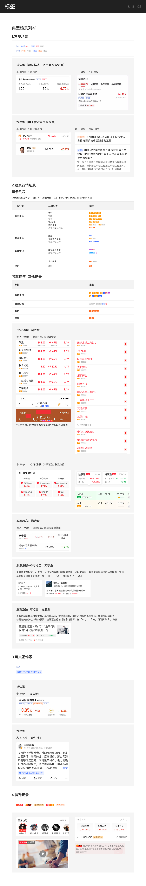

# Tag（标签）

## Overview

用于内容标记和分类的小标签，尤其在股票、基金等金融场景中广泛使用。

**设计师：** 毛帅

---

## 命名规范

组件命名遵循统一结构：

```
Label / [Size] / [Style] / [Color]-[State]
```

示例：
- `Label/16中/浅底/蓝-突出` → 16号中等 + 浅底 + 蓝色 + 突出状态
- `Label/10极小/实底/橙` → 10号极小 + 实底 + 橙色 + 默认状态

---

## Sizes（尺寸）

| 等级 | 字号 | 高度 | 典型场景 |
|---|---|---|---|
| **极小** | 10pt | 10px | 股票列表、期货详情页、表格内容 |
| **小** | 14pt | 14px | 市场数据、港股、搜索结果列表 |
| **中** | 16pt / 18pt | 16px / 18px | 基金详情、可交互场景 |
| **大** | 24pt | 24px | 发现/推荐页面 |

> 必须使用以上四个尺寸等级，禁止自定义中间值。

---

## Styles（视觉样式）

视觉权重从高到低：**实底 > 浅底 > 描边**

### 实底（Filled / 实底）

完整背景色填充，视觉权重最高。

- 可用尺寸：10pt、14pt
- 典型变体：`Label/10极小/实底/蓝`、`Label/14小/实底/红`

### 浅底（Light Background / 浅底）

淡色背景，视觉重量适中。

- 可用尺寸：10pt、14pt、16pt、18pt
- 典型变体：`Label/14小/浅底/蓝-突出`、`Label/16中/浅底/橙`

### 描边（Outlined / 描边）

仅边框，无背景填充；边框宽度 1px（部分场景 2px）。

- 可用尺寸：10pt、14pt、16pt
- 典型变体：`Label/10极小/描边/蓝-突出`、`Label/16中/描边/橙`

---

## Colors（色彩）

| 颜色 | 语义含义 | 典型场景 |
|---|---|---|
| **蓝** | 主色 / 默认 | 基础标签、主要信息、默认状态 |
| **红** | 上涨 / 上升 / 警告 | 股票上涨、正向趋势 |
| **绿** | 下跌 / 下降 | 股票下跌、负向趋势 |
| **橙** | 警告 / 关注 | 特殊关注、高优先级提示 |
| **紫** | 特殊分类 | 特定分类、品牌相关 |
| **酒红** | 次要信息 | 次级信息、附加标记 |
| **金** | 排名 / 特殊身份 | VIP、排名标签 |
| **灰** | 禁用 / 中立 | 禁用状态、次要信息 |

> **金融场景色彩语义约定：** 红色 = 上涨，绿色 = 下跌。禁止反向使用。

---

## States（状态）

| 状态 | 说明 |
|---|---|
| **默认 (default)** | 标准静态状态，大多数场景使用 |
| **突出 (highlighted)** | 强调/高亮状态，用于活跃项、重要标签 |
| **可点击 (clickable)** | 可交互状态，在涨跌标签等可点击场景使用 |
| **禁用 (disabled)** | 不可用，通常用浅底或灰色表示 |

---

## Complete Variant List（完整变体）

### 极小 (10pt)

| 变体 | 样式 | 颜色 |
|---|---|---|
| Label/10极小/实底/蓝 | 实底 | 蓝 |
| Label/10极小/实底/橙 | 实底 | 橙 |
| Label/10极小/实底/酒红 | 实底 | 酒红 |
| Label/10极小/实底/紫 | 实底 | 紫 |
| Label/10-浅/红 | 浅底 | 红 |
| Label/10极小/描边/蓝-突出 | 描边 | 蓝·突出 |
| Label/10极小/描边/红 | 描边 | 红 |
| Label/10极小/描边/灰 | 描边 | 灰 |

### 小 (14pt)

| 变体 | 样式 | 颜色 |
|---|---|---|
| Label/14小/实底/蓝-默认 | 实底 | 蓝·默认 |
| Label/14小/实底/绿 | 实底 | 绿 |
| Label/14小/实底/红 | 实底 | 红 |
| Label/14小/浅底/蓝-突出 | 浅底 | 蓝·突出 |
| Label/14小/浅底/红 | 浅底 | 红 |
| Label/14小/浅底/灰 | 浅底 | 灰 |
| Label/14小/描边/蓝-默认 | 描边 | 蓝·默认 |
| Label/14小/描边/蓝-突出 | 描边 | 蓝·突出 |
| Label/14小/描边/红 | 描边 | 红 |
| Label/14小/描边/橙 | 描边 | 橙 |
| Label/14小/描边/金 | 描边 | 金 |

### 中 (16pt)

| 变体 | 样式 | 颜色 |
|---|---|---|
| Label/16中/浅底/蓝-突出 | 浅底 | 蓝·突出 |
| Label/16中/浅底/橙 | 浅底 | 橙 |
| Label/16中/浅底/灰 | 浅底 | 灰 |
| Label/16中/浅底/金 | 浅底 | 金 |
| Label/16中/浅底/红 | 浅底 | 红 |
| Label/16中/描边/蓝灰 | 描边 | 蓝灰 |
| Label/16中/描边/灰 | 描边 | 灰 |
| Label/16中/描边/橙 | 描边 | 橙 |
| Label/16中/描边/金 | 描边 | 金 |
| Label/16中/描边/红 | 描边 | 红 |
| Label/16中/描边/可点击 | 描边 | — |

### 中 (18pt)

| 变体 | 样式 | 颜色 |
|---|---|---|
| Label/18中/浅底/蓝-突出 | 浅底 | 蓝·突出 |
| Label/18中/浅底/橙 | 浅底 | 橙 |

### 大 (24pt)

| 变体 | 样式 | 用途 |
|---|---|---|
| Label/24大/话题 | 特殊 | 发现/推荐话题 |
| Label/24大/股票涨 | 浅底/红 | 大号涨跌标签·涨 |
| Label/24大/股票跌 | 浅底/绿 | 大号涨跌标签·跌 |

### Stock 特殊变体

#### 股票状态标签

| 变体 | 用途 |
|---|---|
| Label/Stock/小-描边-红 | 股票状态标签·红 |
| Label/Stock/小-描边-蓝 | 股票状态标签·蓝 |

#### 市场标签（`atom/atom-ui-tag-01`）

出现在股票列表行代码旁（y=33，高度 10px），标注股票所属市场或品类。

**通用规格：**

| 属性 | 值 | Token |
|---|---|---|
| 字体 | PingFang SC Medium | `font-family-ios-cn` + `font-weight-medium` |
| 字号 | 9px | `font-size-xxxs` |
| 文字颜色 | `#FFFFFF` | `color-text-inverse` |
| 圆角 | 1px | `radius-extra-small` |
| 水平内边距 | 1px | `padding-super-tight` |
| 垂直内边距 | 0.5px | — |

**各市场变体：**

| 市场 / 品类 | 显示文字 | 背景色 | Token |
|---|---|---|---|
| A股（创业板） | `创` | `#FF9500` | `color-yellow` |
| 港股通 | `HK` | `#3366FF` | `color-blue` |
| 英股 | `UK` | `#E06677` | `color-red-grey` |
| 美股 | `US` | `#B341D9` | `color-purple` |
| 基金 | `基金` | `#FF661A` | `color-orange` |
| 期货 | `期货` | `#29A6FF` | `color-acidblue` |

> A股主板股票不展示任何市场标签（默认市场）。

#### 融资融券标签（`Label/Stock/融`）

| 属性 | 值 | Token |
|---|---|---|
| 显示文字 | `融` | — |
| 背景色 | `#FF661A` | `color-orange` |
| 圆角 | 1px | `radius-extra-small` |
| 容器尺寸（列表行内） | 14×10px | — |

> 融资融券标签与市场标签互不排斥，可同时出现（融在左，市场标签在右）。

---

## Usage Scenarios（场景用法）

### 股票涨跌标签

- **不可点击**：使用文字型（无背景）
- **可点击**：使用浅底型（light background）
- 颜色：红（涨）、绿（跌）
- 尺寸：极小（10pt）用于列表，大（24pt）用于详情页

### 股票状态标签

- 使用描边型（outlined）
- 尺寸：极小（10pt）
- 场景：股票列表行内、市场分类

### 搜索结果列表

- 尺寸：小（14pt）
- 样式：实底或浅底

### 可交互标签（可点击）

- 尺寸：中（16pt）
- 加入 `clickable` 状态

---

## Constraints / Do & Don't

### Do ✓
- 在高信息密度场景使用实底型以确保清晰度
- 严格遵守色彩语义（红 = 上涨，绿 = 下跌）
- 根据层级选择合适的视觉样式（实底 > 浅底 > 描边）
- 可交互场景明确标注 `clickable` 状态

### Don't ✗
- 不要随意自定义尺寸，仅使用四个定义等级
- 不要混用色彩语义（禁止用红色表示下跌）
- 不要在深色背景上使用浅底标签（对比度不足）
- 不要在静态展示场景添加可点击状态

---

## Examples



