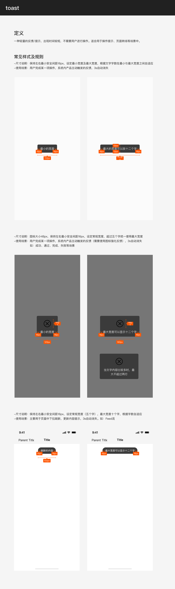

# Toast（提示框）

## Overview

一种轻量的反馈/提示，出现时间较短，不需要用户交互。分为两个子类型：**Toast**（浮层提示）和**刷新提示**（胶囊式）。

**设计师：** 刘勇

---

## 组件类型（Component Types）

| 类型 | Figma 前缀 | 形态 | 使用场景 |
|---|---|---|---|
| Toast | `提示框/02Toast` | 圆角矩形，居中浮层 | 操作结果反馈、状态提示 |
| 刷新提示 | `提示框/03刷新提示` | 全圆角胶囊，顶部滑入 | 下拉刷新、内容更新提示 |

---

## 视觉规范（Visual Styles）

两种类型共用相同背景色与文字色，背景为**固定深色**，不随浅色/深色主题切换：

| 属性 | 值 | Token |
|---|---|---|
| 背景色 | `#3B3B3B` | — ¹ |
| 图标变体文字色 | `rgba(255,255,255,0.84)` | `color-text-inverse-primary` |
| 刷新提示文字色 | `#FFFFFF` | `color-text-inverse` |

> ¹ `#3B3B3B` 无专用 Toast token；`color-visualization-tooltip` 的值与之一致，但语义不符，建议直接使用原始值。

---

## 02 Toast

### 变体

| 变体名称 | 尺寸 | 图标 | 文字行数 |
|---|---|---|---|
| `01最小宽度` | 112×46px | 无 | 1 行 |
| `01最大宽度` | 225×46px | 无 | 1 行 |
| `03常规宽度+图标+单行文字` | 120×118px | 有 | 1 行 |
| `04最大宽度+图标+单行文字` | 225×118px | 有 | 1 行 |
| `05最大宽度+图标+双行文字` | 221×144px | 有 | 2 行 |

### 尺寸规范（纯文字变体）

| 属性 | 值 | Token |
|---|---|---|
| 高度 | 46px | — |
| 宽度最小 | 112px | — |
| 宽度最大 | 225px（约 12 个汉字） | — |
| 左右内边距 | 16px | `padding-extra-loose` |
| 上下内边距 | 12px | `padding-loose` |
| 圆角 | 6px | `radius-large` |

### 尺寸规范（含图标变体）

| 属性 | 值 | Token |
|---|---|---|
| 高度（单行文字） | 118px | — |
| 高度（双行文字） | 144px | — |
| 上边距 | 20px | `margin-extra-loose` |
| 图标尺寸 | 48×48px | `sizing-square-extra-large` |
| 图标与文字间距 | 12px | `padding-loose` |
| 下边距 | 16px | `padding-extra-loose` |
| 最大文字行数 | 2 行 | — |

### 文字规范

| 属性 | 值 | Token |
|---|---|---|
| 字号 | 16px | `font-size-base` |
| 行高 | ~22px（leading-normal） | — ² |
| 字重 | Regular (400) | `font-weight-regular` |
| 对齐 | 水平居中 | — |

> ² 16px 标准配对行高为 `line-height-base`（20px），但 Toast 使用系统自然行高约 22px，保证 46px 高度时上下各 12px 内边距完整（12 + 22 + 12 = 46）。无对应 token，使用 CSS `line-height: normal`。

---

## 03 刷新提示

### 尺寸规范

| 属性 | 值 | Token |
|---|---|---|
| 高度 | 36px | — |
| 宽度最小 | 102px | — |
| 宽度最大 | 200px（约 12 个汉字） | — |
| 左右内边距 | 16px | `padding-extra-loose` |
| 圆角 | 18px（= 高度 / 2，全圆角） | `radius-circle` |

### 文字规范

| 属性 | 值 | Token |
|---|---|---|
| 字号 | 14px | `font-size-medium` |
| 行高 | 18px | `line-height-medium` |
| 字重 | Regular (400) | `font-weight-regular` |
| 对齐 | 水平居中 | — |

---

## 位置与安全边距

| 规则 | 说明 |
|---|---|
| 水平居中 | Toast 和刷新提示均水平居中于页面 |
| 左右最小安全间距 | 16px（屏幕边缘到组件外边界） |
| 页面位置 | Toast 通常居中偏下；刷新提示从顶部导航栏下方滑入 |

---

## Constraints / Do & Don't

| | 规则 |
|---|---|
| ✅ | 文字内容控制在 12 个汉字以内（最大宽度限制） |
| ✅ | 有图标时：单行或最多双行文字 |
| ✅ | Toast 不需要用户交互，自动消失 |
| ✅ | 刷新提示使用全圆角（胶囊形），Toast 使用 6px 圆角 |
| ❌ | 不要在 Toast 中放置可交互元素（按钮、链接） |
| ❌ | 不要超过 2 行文字（有图标）或强制换行（纯文字） |
| ❌ | 不要修改背景颜色以适应浅色模式，Toast 背景固定深色 |

---

## Examples

