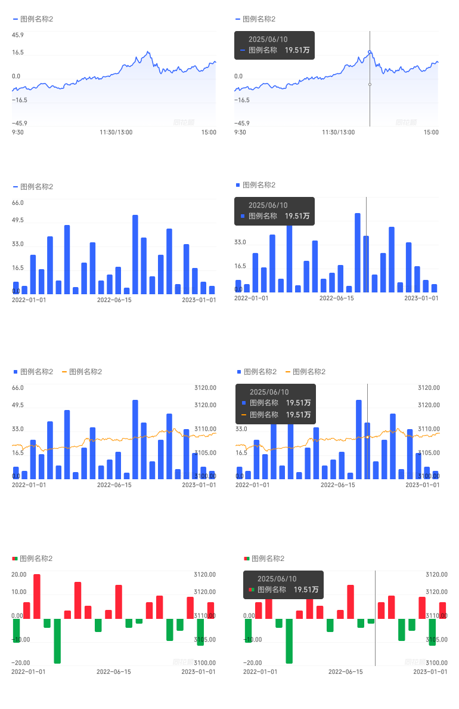

# 可视化图表（Charts）

## Overview

图表组件用于展示时序与对比数据，现包含五种图表类型：**折线图**、**柱状图**、**折柱图（柱+折线组合）**、**红绿柱图（涨跌色柱）**、**K线图（蜡烛图）**。各类型共享相同的图例区域、坐标轴与范围滑块规范，差异在图形绘制方式、图例标记形状，以及交互模式（看板 vs 十字光标）。

---

## 共享规范（所有图表类型通用）

### 整体尺寸与布局

| 属性 | 值 |
|---|---|
| 宽度 | 343px |
| 布局 | flex-col，各区域 8px 间距 |
| 图表区高度 | 178px |

结构：
```
[ 图例区域（05图例区域） ]   ← 始终显示
[ 图表区域              ]   ← 178px 高
[ 滑块（.滑块）         ]   ← 仅 看板=on 时显示，24px 高
```

---

### 图例区域（05图例区域）

| 属性 | 值 |
|---|---|
| 上下内边距 | 4px |
| 图例项间距（水平） | 12px |
| 图例行间距（垂直，换行时） | 4px |

每个图例项由**图例标记 + 图例标签**组成，标记与标签之间 **2px** 间距。图例标记形状因图表类型而异（见下方各类型规范），标签样式统一：

| 元素 | 字号 | 行高 | 字体 | 颜色 | Token |
|---|---|---|---|---|---|
| 图例标签 | 12px | 16px | PingFang SC Regular | `rgba(0,0,0,0.6)` | `font-family-ios-cn`, `color-text-secondary` |

**换行规则**

| 图例数量 | 布局 |
|---|---|
| 1 / 2 / 3 项 | 单行，横向排列，12px 间距 |
| 4 / 5 / 6 项 | 自动换行（flex-wrap），水平间距 12px，行间距 4px |

**可选右侧下拉**：图例区域右端可配置一个下拉选项（文字 + 下箭头图标，12px `font-family-ios-cn` `font-weight-regular`，`color-text-primary`），用于切换指标或周期。

---

### 坐标轴标签

**Y 轴**

| 属性 | 值 | Token |
|---|---|---|
| 字号 | 10px | — |
| 字体 | THS JinRongTi Medium | `font-family-number` |
| 颜色 | `rgba(0,0,0,0.6)` | `color-text-secondary` |
| 主 Y 轴位置 | 图表左侧，右对齐 | — |
| 副 Y 轴位置 | 图表右侧，左对齐（需双轴时启用） | — |
| 刻度数量 | 5 条，等间距分布 | — |

**X 轴**

| 属性 | 值 | Token |
|---|---|---|
| 字号 | 10px | — |
| 字体 | THS JinRongTi Medium | `font-family-number` |
| 颜色 | `rgba(0,0,0,0.6)` | `color-text-secondary` |
| 标签布局 | 左/中/右各一个，分别左对齐/居中/右对齐 | — |
| 位置 | 图表底部约 10% 高度区域 | — |

X 轴时间标签示例：
- A 股日内：`9:30`（左）/ `11:30/13:00`（中）/ `15:00`（右）
- 日/周/月线：`2022-01-01`（左）/ `2022-06-15`（中）/ `2023-01-01`（右）

### 网格线

图表绘图区内 5 条水平网格线，等间距，细实线。

### 水印

图表右下角显示「同花顺」水印，颜色极浅（`color-text-secondary` 极低透明度），不遮挡数据。

---

### 看板（Tooltip，看板=on）

#### 气泡卡片

| 属性 | 值 | Token |
|---|---|---|
| 背景色 | `#3b3b3b` | `color-visualization-tooltip` |
| 内边距 | 8px | — |
| 圆角 | 4px | — |
| 内部行间距 | 4px | — |

**日期行**

| 属性 | 值 | Token |
|---|---|---|
| 字号 | 12px | — |
| 字体 | THS JinRongTi Medium | `font-family-number` |
| 颜色 | `rgba(255,255,255,0.6)` | `color-text-inverse-secondary` |
| 对齐 | 左对齐，文本缩进 16px | — |

**数据行**（每条数据系列一行，flex，justify-between，12px 间距）

| 元素 | 字号 | 行高 | 字体 | 颜色 | Token |
|---|---|---|---|---|---|
| 图例标记 | 12×12px | — | — | 跟随系列色 | — |
| 系列名称 | 12px | 16px | PingFang SC Regular | `rgba(255,255,255,0.84)` | `font-family-ios-cn`, `color-text-inverse-primary` |
| 数值 | 12px | 16px | THS JinRongTi Medium | `rgba(255,255,255,0.84)` | `font-family-number`, `color-text-inverse-primary` |
| 单位（如「万」） | 12px | 16px | THS JinRongTi **Bold** | 同上 | `font-family-number`, `font-weight-bold` |

数值右对齐，系列名称左对齐。

#### 十字准线

看板激活时，在当前时间点绘制：
- 垂直细线从图表顶部延伸至 X 轴
- 折线图：在折线与竖线交点处绘制高亮圆点（空心外圈 + 实心内点）
- 柱状图：高亮当前柱条（通常降低其余柱条透明度）

---

### 滑块（Range Slider，看板=on）

| 属性 | 值 | Token |
|---|---|---|
| 高度 | 24px | — |
| 宽度 | 与图表等宽（343px） | — |

**把手（左/右各一）**

| 属性 | 值 | Token |
|---|---|---|
| 尺寸 | 24×24px | — |
| 背景色 | 白色 | `color-foreground-layer2` |
| 边框 | 0.33px solid `rgba(0,0,0,0.24)` | `color-text-quaternary` |
| 圆角 | 6px | — |
| 内部图标 | 3 条竖向短线（三线 grip 图标） | — |

**轨道**

| 区域 | 说明 | Token |
|---|---|---|
| 选中范围内（两把手之间） | 微缩版图表预览 | — |
| 选中范围外（左侧遮罩） | `rgba(0,0,0,0.04)` 半透明遮罩，左端圆角 4px | `color-background-weak` |

---

## 折线图（Line Chart）

### 变体

| 维度 | 可选值 |
|---|---|
| 折线数量 | 1 / 2 / 3 / 4 / 5 / 6 折线 |
| 看板 | on / off |

### 图例标记

Figma 节点名：`可视化/06元素-图例/01折线`

12×12px 容器，内部为**水平短横线**（高度约 2px，宽度约 70%，圆角 1px），颜色跟随折线色。

### 图形规范

- 折线：连续曲线，描边颜色跟随系列色
- 填充：折线与基准轴之间有渐变填充区域（由深到浅，向下收窄）

### Y 轴规则

| 折线数量 | Y 轴数量 | 说明 |
|---|---|---|
| 1 条 | 1（左） | 单一量纲 |
| 2+ 条（不同量纲） | 2（左 + 右） | 各轴独立刻度 |

---

## 柱状图（Bar Chart）

### 变体

| 维度 | 可选值 |
|---|---|
| 折柱数量 | 单柱 |
| 看板 | on / off |

### 图例标记

Figma 节点名：`可视化/06元素-图例/02柱子`

12×12px 容器，内部为居中**小方块**（约 6×6px，圆角 1px），颜色跟随柱色。

### 图形规范

| 属性 | 值 | Token |
|---|---|---|
| 柱色 | `#3366ff` | `color-blue` |
| 顶部圆角 | 2px（仅上左、上右） | — |
| 底部圆角 | 无 | — |

柱条等宽均匀排列，高度由数值决定，自底部向上生长。

### Y 轴规则

单 Y 轴（左侧），Y=0 位于底部（柱状图一般展示正值数据）。

---

## 折柱图（Bar + Line Combo）

### 变体

| 维度 | 可选值 |
|---|---|
| 折柱数量 | 单柱+1折 / 单柱+2折 / 单柱+3折 |
| 看板 | on / off |

### 图例标记

图例区同时显示柱与折线的图例项：
- 柱：`可视化/06元素-图例/02柱子`（小方块）
- 折线：`可视化/06元素-图例/01折线`（水平横线）

### 图形规范

| 系列 | 图形 | 颜色 | Token |
|---|---|---|---|
| 柱 | 同柱状图，顶部圆角 2px | `#3366ff` | `color-blue` |
| 第 1 条折线 | 同折线图 | `#ff9500` | `color-yellow` |
| 第 2 条折线 | 同折线图 | 可视化顺序色板第 3 色 | — |
| 第 3 条折线 | 同折线图 | 可视化顺序色板第 4 色 | — |

### Y 轴规则

折柱图**始终启用双 Y 轴**：

| Y 轴 | 数据来源 | 位置 | 对齐 |
|---|---|---|---|
| 主 Y 轴（左） | 柱状数据 | 左侧 | 右对齐 |
| 副 Y 轴（右） | 折线数据 | 右侧 | 左对齐 |

---

## 红绿柱图（Red-Green Bar Chart）

### 变体

| 维度 | 可选值 |
|---|---|
| 折柱数量 | 单红绿柱 / 红绿柱+1折 |
| 看板 | on / off |

### 图例标记

**红绿柱系列**：Figma 节点名 `可视化/06元素-图例/05红绿柱`

12×12px 容器，内部为**左右分割双色小块**（各占 50% 宽度，高度约 50%，1px 圆角）：
- 左半块：`color-price-up`（`#ff2436`，红色）—— 圆角在左上、左下角
- 右半块：`color-price-down`（`#07ab4b`，绿色）—— 圆角在右上、右下角

**叠加折线系列**：Figma 节点名 `可视化/06元素-图例/01折线`

水平短横线，颜色为 `color-visualization-09`（`#858585`，中灰色）。

### 图形规范

| 柱类型 | 颜色 | Token | 方向 |
|---|---|---|---|
| 上涨（正值）柱 | `#ff2436` | `color-price-up` | 从基准线（0）向上生长 |
| 下跌（负值）柱 | `#07ab4b` | `color-price-down` | 从基准线（0）向下生长 |

- 所有柱均有顶部 2px 圆角（上左、上右），底部无圆角
- Y=0 基准线是红绿柱的分界点，因此 Y 轴范围含正负区间（如 -20.00 ~ +20.00）

**叠加折线（红绿柱+折线）**

| 属性 | 值 | Token |
|---|---|---|
| 折线颜色 | `#858585` | `color-visualization-09` |
| 折线图例标记 | 水平横线（同折线图标记形状） | — |

### Y 轴规则

| 配置 | Y 轴数量 | 说明 |
|---|---|---|
| 单红绿柱 | 1（左） | 含正负区间，0 为基准线 |
| 红绿柱+折线 | 2（左 + 右） | 左轴：红绿柱数据；右轴：折线数据 |

---

## K 线图（Candlestick Chart）

### 变体

| 维度 | 可选值 |
|---|---|
| 折柱数量 | 单K线 / K线+1折 |
| 十字光标 | on / off |

> ⚠️ K 线图的交互维度名称是**十字光标**，不是「看板」，两者行为不同——看板弹出 Tooltip 气泡，十字光标绘制十字准线并在轴上打标签。

### 图例标记

**K线系列**：Figma 节点名 `可视化/06元素-图例/04蜡烛`

12×12px 容器，内部为**缩略蜡烛图**（含实体和上下影线），颜色使用涨跌色。

**叠加折线系列**：Figma 节点名 `可视化/06元素-图例/01折线`

水平短横线，颜色 `color-blue`（`#3366ff`）。

### 蜡烛规范

| K线类型 | 实体 | 影线 | Token |
|---|---|---|---|
| 阳线（收盘 > 开盘，上涨） | 实心红色矩形 | 红色细线（上下各一） | `color-price-up`（`#ff2436`） |
| 阴线（收盘 < 开盘，下跌） | 空心矩形（边框绿色，内部透明） | 绿色细线（上下各一） | `color-price-down`（`#07ab4b`） |

### Y 轴规则

K 线图 Y 轴**只显示 3 个价格刻度**（顶部、中部、底部），而非其他图表的 5 个：

| 位置 | 说明 | Token |
|---|---|---|
| 字号 | 10px | — |
| 字体 | THS JinRongTi Medium | `font-family-number` |
| 颜色 | `rgba(0,0,0,0.6)` | `color-text-secondary` |
| 主 Y 轴（左） | 右对齐，显示价格 | — |
| 副 Y 轴（右） | 左对齐，仅 K线+折线 时启用，显示折线数据 | — |

图表绘图区中部有一条 **0.5px 水平参考线**（中价线），颜色同网格线。

### 十字光标（十字光标=on）

十字光标由**水平线 + 垂直线 + 轴标签**组成，无悬浮气泡：

**水平线**：横跨图表全宽，颜色淡灰，标识当前 Y 值。

**垂直线**：纵跨图表全高，颜色淡灰，标识当前 X 时间点。

**Y 轴标签**（价格标签）

| 属性 | 值 | Token |
|---|---|---|
| 背景色 | `#3366ff` | `color-blue` |
| 圆角 | 2px | — |
| 文字 | 价格数值，10px，THS JinRongTi Medium，白色 | `font-family-number` |
| 位置 | 附着在 Y 轴左侧，垂直居中于十字横线 | — |

**X 轴标签**（日期标签）

| 属性 | 值 | Token |
|---|---|---|
| 背景色 | `#3366ff` | `color-blue` |
| 圆角 | 2px | — |
| 文字 | 日期，10px，THS JinRongTi Medium，白色 | `font-family-number` |
| 位置 | 附着在 X 轴底部，水平居中于十字竖线 | — |

### 叠加折线（K线+1折）

| 属性 | 值 | Token |
|---|---|---|
| 折线颜色 | `#3366ff` | `color-blue` |
| 双 Y 轴 | 左轴：K线价格；右轴：折线数据 | — |

---

## 颜色系统

### 顺序色板（折线图多条折线 / 折柱图叠加折线）

多系列图表按以下顺序依次分配颜色（第 N 条系列取第 N 色）：

| 顺序 | 十六进制 | Token / 说明 |
|---|---|---|
| 1 | `#3366ff` | `color-blue` |
| 2 | `#ff9500` | `color-yellow` |
| 3 | `#cc41d9` | 无独立 token，直接使用值 |
| 4 | `#14ccbd` | 无独立 token，直接使用值 |
| 5 | `#52bbff` | 无独立 token，直接使用值 |
| 6 | `#858585` | `color-visualization-09` |

> 折柱图中，柱系列固定使用 `color-blue`（第 1 色），叠加折线从第 2 色（`color-yellow`）开始顺序分配。

### 功能色

| 用途 | Token | 值 |
|---|---|---|
| 折线图第 1 条 / 纯柱状图 / K线叠加折线 | `color-blue` | `#3366ff` |
| 红绿柱（上涨）/ K线阳线 | `color-price-up` | `#ff2436` |
| 红绿柱（下跌）/ K线阴线 | `color-price-down` | `#07ab4b` |
| 红绿柱叠加折线 | `color-visualization-09` | `#858585` |
| K线十字光标轴标签背景 | `color-blue` | `#3366ff` |
| Tooltip 背景 | `color-visualization-tooltip` | `#3b3b3b` |

> 禁止硬编码颜色值；有 token 的系列颜色必须通过 token 引用，无 token 的直接使用规范色值。

---

## 图例标记汇总

所有图例标记均为 12×12px 容器。SVG 资源位于 `assets/icons/visualization/`。

| Figma 节点名 | SVG 文件 | 标记形状 | 颜色处理 | 用途 |
|---|---|---|---|---|
| `可视化/06元素-图例/01折线` | `legend-line.svg` | 居中水平短线（约 70% 宽，2px 高，1px 圆角） | `currentColor`，跟随系列色 | 折线图各系列 / 折柱图叠加折线 / K线叠加折线 |
| `可视化/06元素-图例/02柱子` | `legend-bar.svg` | 居中小方块（6×6px，1px 圆角） | `currentColor`，跟随系列色 | 柱状图 / 折柱图柱系列 |
| `可视化/06元素-图例/03虚线` | `legend-dashed.svg` | 两段短线并排模拟虚线（各 3.5×2px，1px 圆角，中间 1px 间隔） | `currentColor`，跟随系列色 | 虚线型叠加参考线 |
| `可视化/06元素-图例/04蜡烛` | `legend-candle.svg` | 缩略蜡烛图（左侧实心红阳线 + 右侧空心绿阴线） | 固定色：阳 `#ff2436` / 阴 `#07ab4b` | K线图 |
| `可视化/06元素-图例/05红绿柱` | `legend-rg-bar.svg` | 左右双色分割小块（左红右绿，各占 50% 宽，1px 圆角） | 固定色：涨 `#ff2436` / 跌 `#07ab4b` | 红绿柱图 |

**颜色处理说明**
- `currentColor` 类型：实现时在 SVG 容器上设置 CSS `color: <系列色>`，SVG 内部 `fill="currentColor"` 自动继承
- 固定色类型：颜色硬编码在 SVG 内部，不受外部 `color` 影响，始终使用涨跌色

---

## Constraints / Do & Don't

| | 规则 |
|---|---|
| ✅ | Y/X 轴标签、Tooltip 数值均使用 `font-family-number`（THS JinRongTi） |
| ✅ | Tooltip 数值单位（「万」「亿」等）使用 THS JinRongTi **Bold** |
| ✅ | 折柱图始终使用双 Y 轴，左轴对应柱，右轴对应折线 |
| ✅ | 红绿柱+折线时，启用双 Y 轴；折线使用 `color-visualization-09`（灰色） |
| ✅ | 折线图 2 条以上且量纲不同时，启用双 Y 轴 |
| ✅ | 看板=on 时，Tooltip 气泡、十字准线、范围滑块三者同时出现 |
| ✅ | 所有柱条顶部圆角 2px，底部无圆角 |
| ✅ | 红绿柱的基准线（Y=0）必须在视口内可见 |
| ❌ | 不要硬编码系列颜色，必须通过 token 引用 |
| ❌ | 不要在单 Y 轴上混排量纲差异过大的多条折线或折柱数据 |
| ❌ | A 股场景下不要省略 X 轴中间的午休分隔标签（`11:30/13:00`） |
| ❌ | 不要在折柱图中将折线与柱使用相同颜色 |
| ❌ | 不要在红绿柱的叠加折线中使用 `color-blue` 或 `color-yellow`，应使用 `color-visualization-09` |
| ✅ | K线图阳线（上涨）用实心红色矩形，阴线（下跌）用空心矩形（边框绿色，内部透明） |
| ✅ | K线图 Y 轴只展示 3 个价格刻度（顶/中/底），十字光标标签用 `color-blue` 背景 + 白色文字 |
| ❌ | 不要把 K线图的「十字光标」误用为其他图表的「看板」——两者机制不同，不可混用 |

---

## Examples


